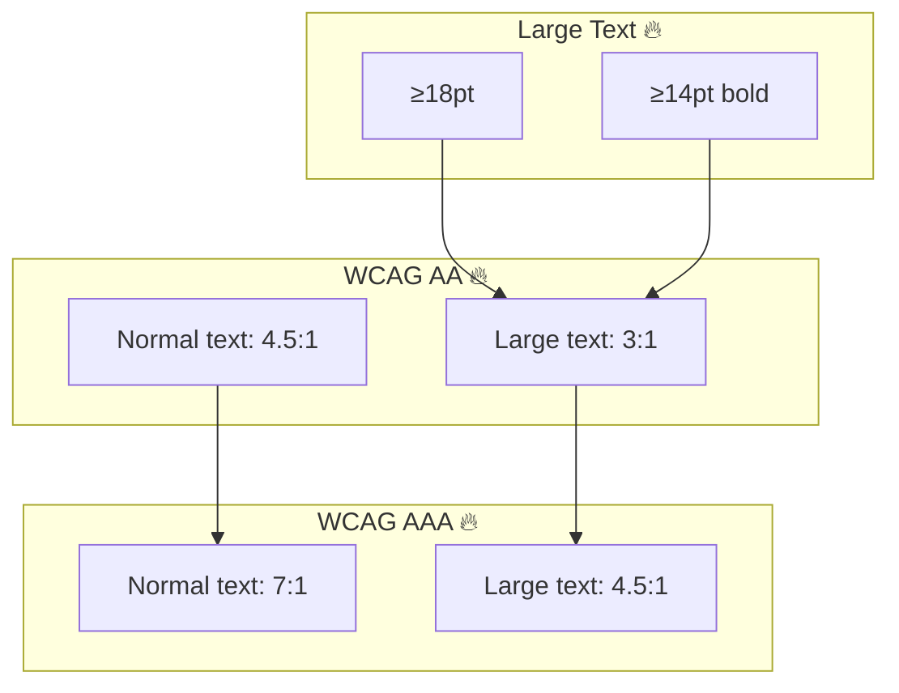
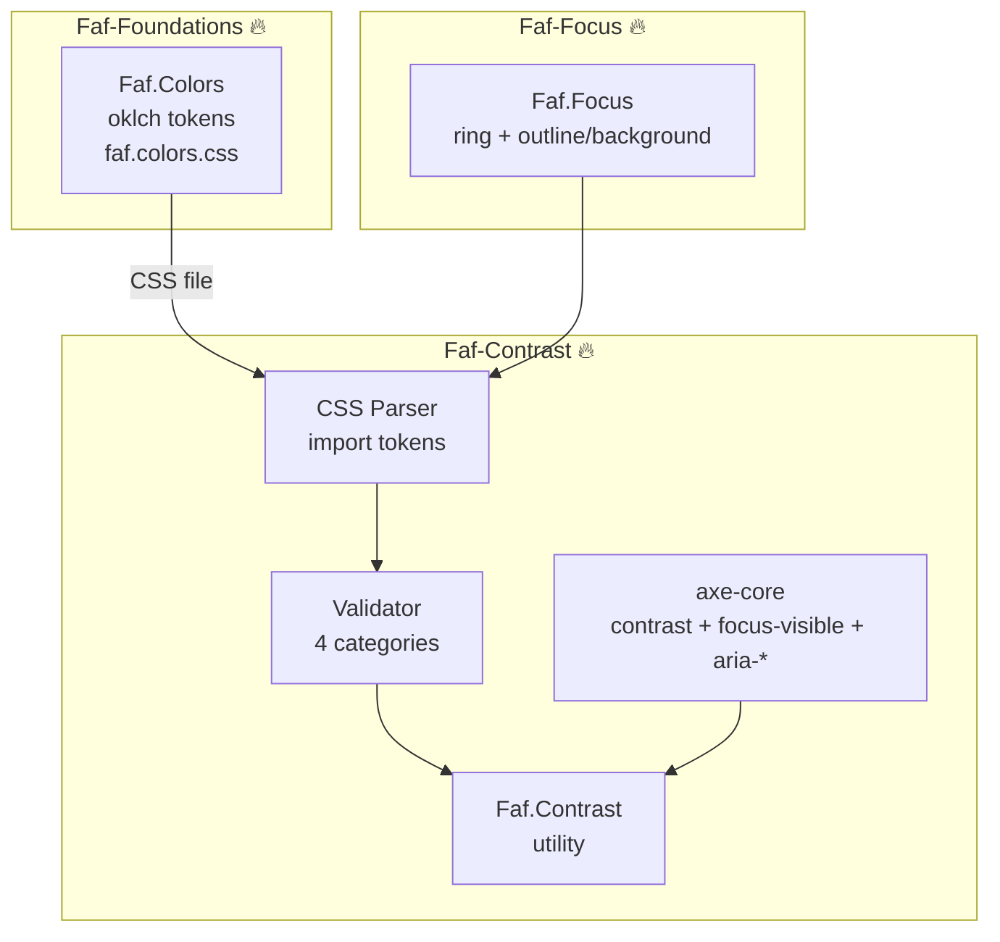
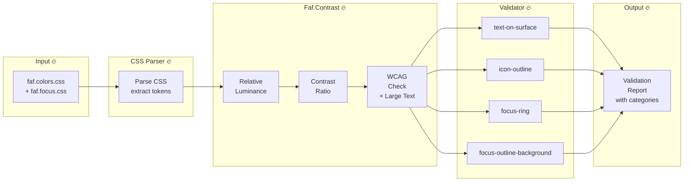
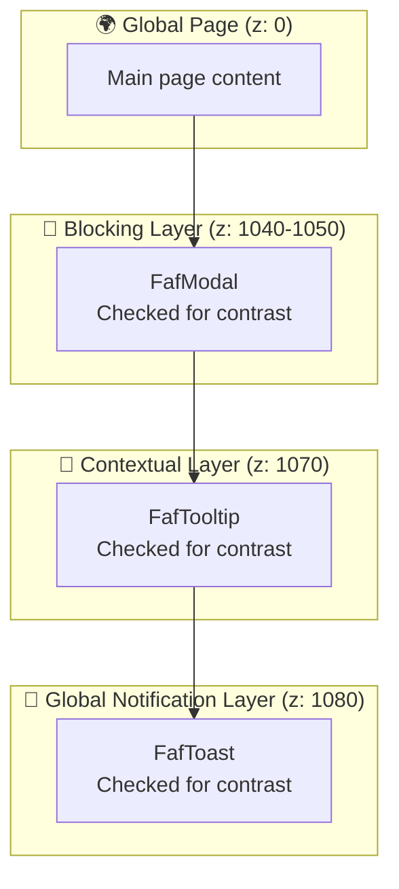

# @faf/contrast

> [EN](./README.md) | [RU](./README.ru.md)

**WCAG Contrast Checking Utility for the Faf Design System** — provides mathematical contrast calculation, automated token validation, and accessibility reporting to ensure your design system meets WCAG 2.1 AA/AAA standards.

---

## 📁 Package Structure

```bash
packages/contrast/
├── src/
│   ├── types/
│   │   └── contrast.ts                 # 🔥 Strict TypeScript interfaces
│   ├── utils/
│   │   ├── faf-contrast.ts             # 🔥 Core contrast calculation engine
│   │   └── css-token-parser.ts         # 🔥 CSS variable extractor
│   ├── validators/
│   │   ├── faf-colors-validator.ts     # 🔥 Token validator (4 categories)
│   │   └── faf-focus-validator.ts      # 🔥 Focus state validator
│   └── index.ts                        # Main entry point
├── tests/                              # 🔥 Vitest + Playwright + axe-core
├── viewer/                             # 🔥 Interactive documentation
├── docs/                               # 🔥 Detailed guides
├── examples/                           # 🔥 Standalone HTML demo
├── package.json
└── tsconfig.json
```

---

## 🏗️ Architectural Diagrams

### 1. WCAG Contrast Requirements



### 2. Ecosystem Integration



### 3. Contrast Validation Flow



### 4. Layer Contract Integration



---

## 🚀 Quick Start

### 1. Basic Contrast Check

```typescript
import { FafContrast } from "@faf/contrast";

const isAccessible = FafContrast.isAccessible(
  "#111827", // foreground
  "#ffffff", // background
  "AA", // WCAG level
  "normal", // text size
);

console.log(isAccessible); // true
```

### 2. Detailed Contrast Information

```typescript
const info = FafContrast.getAccessibilityInfo("#111827", "#ffffff");
console.log(info);
// {
//   ratio: 21.0,
//   aa: { normal: true, large: true },
//   aaa: { normal: true, large: true }
// }
```

### 3. Validating Design Tokens

```typescript
import { FafColorsValidator } from "@faf/contrast";

const validator = new FafColorsValidator();
const report = await validator.validateAll("./path/to/tokens.css");

console.log(`Passed: ${report.passed}, Failed: ${report.failed}`);

// Generate Markdown report
const markdown = validator.generateMarkdownReport(report);
console.log(markdown);
```

---

## 🏗️ Architecture & FAF Styling Contract

This package strictly adheres to the **FAF Web Components Styling Contract**:

- **Encapsulation**: Structure and local states are managed inside Shadow DOM.
- **Theming**: Built on CSS custom properties `--faf-*`, which inherit through the shadow boundary.
- **Context**: `:host-context()` is used **only** for context-aware token mapping (e.g., dark mode), never for duplicating state logic.
- **Slots**: `::slotted()` is used ONLY for simple styling of projected content, without complex hover/focus scenarios.
- **Domain Agnostic**: Validators accept configurable `TokenCategoryConfig`, allowing external design systems to use this utility with their own token prefixes.

---

## ⚠️ Limitations and Allowances

To maintain transparency, please note the following limitations of the current implementation:

1. **Simplified OKLCH Conversion**: The `oklch` to `RGB` conversion uses a simplified mathematical approximation (error margin ~2-5%). **For production**, replace the internal `parseOklch` method with a robust library like [`culori`](https://culorijs.org) or [`colorjs.io`](https://colorjs.io).
2. **Regex CSS Parser**: The `CssTokenParser` uses regular expressions for extraction. This is sufficient for static files and prototyping. For complex, dynamic production builds, consider using **PostCSS**.
3. **WCAG 2.1 Only**: This utility implements WCAG 2.1 criteria. It does not cover newer WCAG 2.2 criteria (e.g., Focus Not Obscured).
4. **No APCA**: The Advanced Perceptual Contrast Algorithm (APCA) is not implemented. We use the standard WCAG Relative Luminance formula.
5. **No CI/CD Pipeline**: Tests are provided, but automated CI/CD integration (e.g., GitHub Actions) must be configured separately in your repository (planned for Course 12: Faf-Testing).

---

## 🧪 Testing

```bash
# Unit tests (Vitest)
pnpm run test

# E2E accessibility tests (Playwright + axe-core)
pnpm run test:e2e

# E2E tests in interactive UI mode
pnpm run test:e2e:ui
```

---

## 📖 Documentation

- [WCAG Guide](./docs/wcag-guide.md)
- [Contrast Best Practices](./docs/contrast-guide.md)
- [Manual Testing Guide](./docs/manual-testing-guide.md)
- [Sample Validation Report](./docs/validation-report.md)

---

## 📝 License

MIT © Faf Design System
