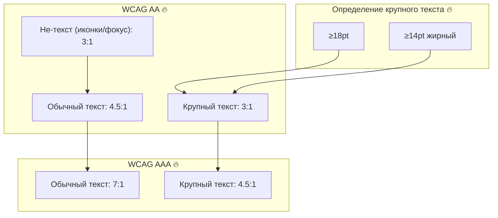
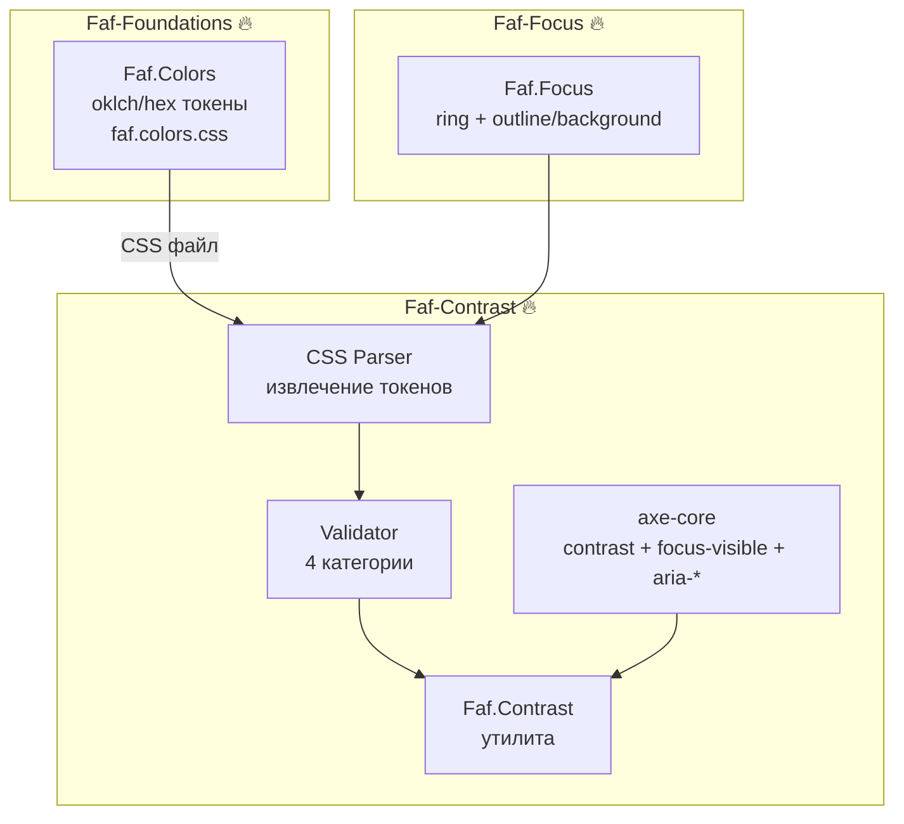
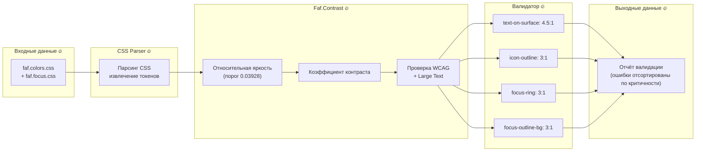
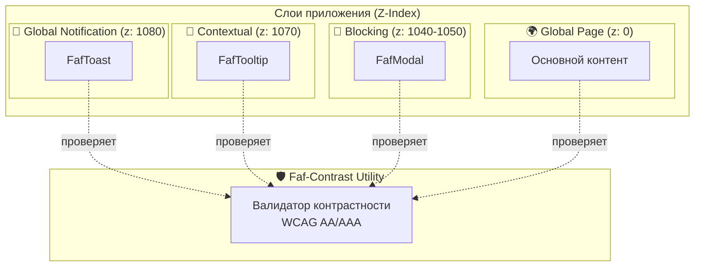

# @faf/contrast

> [EN](./README.md) | [RU](./README.ru.md)

**Утилита проверки контрастности WCAG для дизайн-системы Faf** — предоставляет математический расчёт контраста, автоматизированную валидацию токенов и отчёты о доступности для обеспечения соответствия стандартам WCAG 2.1 AA/AAA.

---

## 📁 Структура пакета

```bash
packages/contrast/
├── src/
│   ├── types/
│   │   └── contrast.ts                 # 🔥 Строгие TypeScript-интерфейсы
│   ├── utils/
│   │   ├── faf-contrast.ts             # 🔥 Ядро расчёта контрастности (порог WCAG 0.03928)
│   │   └── css-token-parser.ts         # 🔥 Надёжный извлекатель CSS-переменных
│   ├── validators/
│   │   ├── faf-colors-validator.ts     # 🔥 Валидатор токенов (4 категории, логика 3:1 vs 4.5:1)
│   │   └── faf-focus-validator.ts      # 🔥 Валидатор состояний фокуса (требует 3:1)
│   └── index.ts                        # Главная точка входа
├── tests/                              # 🔥 Vitest + Playwright + axe-core
├── viewer/                             # 🔥 Интерактивная документация (двуязычный UI, соответствующий WCAG)
├── docs/                               # 🔥 Подробные руководства
├── examples/                           # 🔥 Автономное HTML-демо
├── package.json
└── tsconfig.json
```

---

## 🏗️ Архитектурные диаграммы

### 1. Требования к контрастности WCAG



### 2. Интеграция с экосистемой



### 3. Поток валидации контрастности



### 4. Интеграция с Layer Contract



---

## 🚀 Быстрый старт

### 1. Базовая проверка контраста

```typescript
import { FafContrast } from "@faf/contrast";

const isAccessible = FafContrast.isAccessible(
  "#111827", // цвет текста (foreground)
  "#ffffff", // цвет фона (background)
  "AA", // уровень WCAG
  "normal", // размер текста
);

console.log(isAccessible); // true
```

### 2. Детальная информация о контрастности

```typescript
const info = FafContrast.getAccessibilityInfo("#111827", "#ffffff");
console.log(info);
// {
//   ratio: 21.0,
//   aa: { normal: true, large: true },
//   aaa: { normal: true, large: true }
// }
```

### 3. Валидация дизайн-токенов

```typescript
import { FafColorsValidator } from "@faf/contrast";

const validator = new FafColorsValidator();
const report = await validator.validateAll("./path/to/tokens.css");

console.log(`Прошло: ${report.passed}, Не прошло: ${report.failed}`);

// Генерация Markdown-отчёта (ошибки автоматически сортируются по наименьшему контрасту)
const markdown = validator.generateMarkdownReport(report);
console.log(markdown);
```

---

## 🏗️ Архитектура и FAF Styling Contract

Этот пакет строго следует **FAF Web Components Styling Contract**:

- **Инкапсуляция**: Каждый компонент управляет структурой и локальными состояниями (`:hover`, `:focus`, `:active`, `disabled`) внутри Shadow DOM.
- **Темизация**: Строится на CSS custom properties `--faf-*`, потому что они наследуются через границу shadow root.
- **Контекст**: `:host-context()` разрешён **только** для контекстных переопределений токенов, а не для дублирования state-логики.
- **Слоты**: `::slotted()` используется только для простого оформления projected content, без сложных hover/focus сценариев.
- **Локальные переменные**: Внутри компонента допустимы локальные переменные вида `--item-hover-bg`, если они маппятся на глобальные токены.
- **Независимость от домена**: Валидаторы принимают конфигурируемый `TokenCategoryConfig`, позволяя внешним дизайн-системам использовать эту утилиту со своими префиксами токенов.

**Рекомендуемый паттерн:**

```css
:host {
  --item-hover-bg: var(--faf-color-gray-100);
  --item-hover-text: var(--faf-color-gray-900);
  color: var(--faf-color-text);
}
:host-context([data-theme="dark"]) {
  --item-hover-bg: var(--faf-color-gray-700);
  --item-hover-text: var(--faf-color-gray-100);
}
:host(:hover),
:host(:focus) {
  background-color: var(--item-hover-bg);
  color: var(--item-hover-text);
}
```

_Это разделяет ответственность: тема меняет значения переменных, а состояние просто читает уже готовые токены. Такой подход легче расширять на новые темы, чем кодировать ветвления прямо в `:hover`-правилах._

**Чего мы избегаем:**

- Не строим дизайн-систему на `::slotted()` для интерактивных состояний.
- Не используем `:host-context()` как основной механизм, если можно обойтись токенами.
- Не смешиваем layout, theme mapping и state logic в одном CSS-блоке.
- Не хардкодим цвета там, где уже существуют семантические `--faf-*` токены.

---

## ⚠️ Ограничения и допуски

Для обеспечения прозрачности, пожалуйста, обратите внимание на следующие ограничения текущей реализации:

1. **Упрощённая конвертация OKLCH**: Конвертация `oklch` в `RGB` использует упрощённую математическую аппроксимацию (погрешность ~2-5%). **Для production** замените внутренний метод `parseOklch` на проверенную библиотеку, такую как [`culori`](https://culorijs.org) или [`colorjs.io`](https://colorjs.io). _(Примечание: базовый расчёт яркости строго использует корректный порог WCAG `0.03928`, а `parseRgb` надёжно обрабатывает проценты, пробелы и ограничение диапазона 0-255)._
2. **Regex CSS Парсер**: `CssTokenParser` использует регулярные выражения для извлечения. Этого достаточно для статических файлов и прототипов. Для сложных production-сборок рекомендуется использовать **PostCSS**.
3. **Только WCAG 2.1**: Утилита реализует критерии WCAG 2.1 (включая требование 3:1 для не-текстовых UI-компонентов, таких как иконки и фокус). Она не покрывает новые критерии WCAG 2.2 (например, Focus Not Obscured).
4. **Отсутствие APCA**: Алгоритм Advanced Perceptual Contrast Algorithm (APCA) не реализован. Мы используем стандартную формулу Relative Luminance из WCAG.
5. **Отсутствие CI/CD**: Тесты предоставлены, но автоматизация CI/CD (например, GitHub Actions) должна быть настроена отдельно в вашем репозитории (запланировано в Курсе 12: Faf-Testing).

---

## 🧪 Тестирование

```bash
# Unit-тесты (Vitest)
pnpm run test

# E2E-тесты доступности (Playwright + axe-core)
pnpm run test:e2e

# E2E-тесты в интерактивном UI-режиме
pnpm run test:e2e:ui
```

---

## 📖 Документация

- [Руководство по контрастности WCAG](./docs/wcag-guide.ru.md)
- [Лучшие практики контрастности](./docs/contrast-guide.ru.md)
- [Руководство по ручному тестированию](./docs/manual-testing-guide.ru.md)
- [Пример отчёта валидации](./docs/validation-report.ru.md)

---

## 📝 Лицензия

MIT © Faf Design System

---
