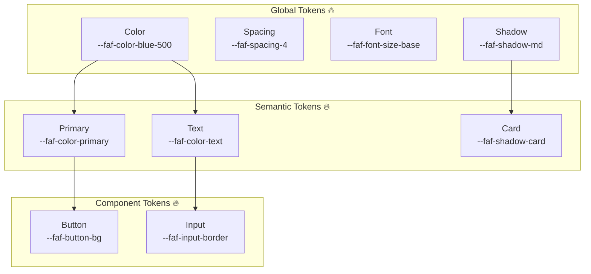
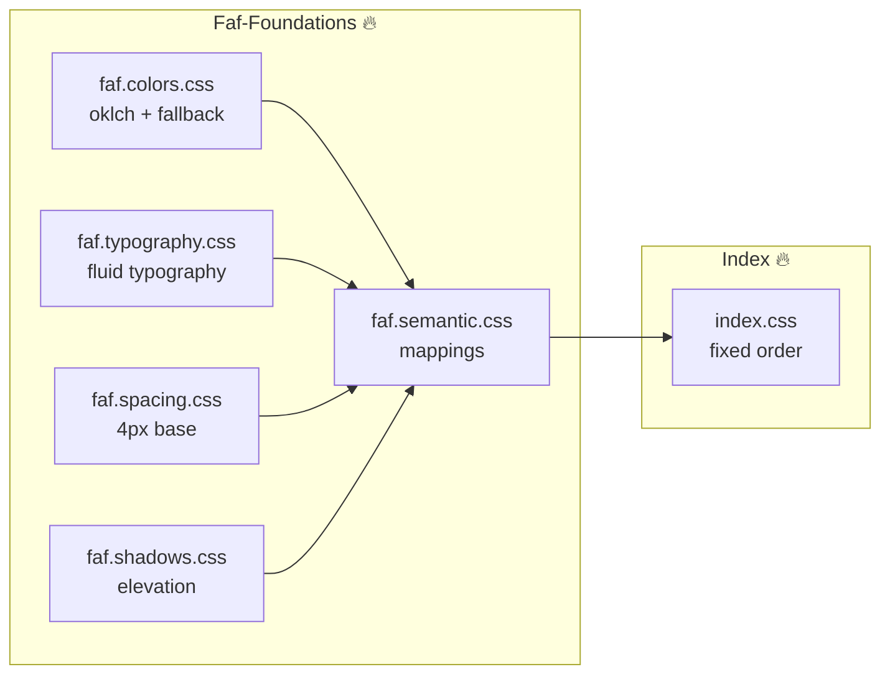
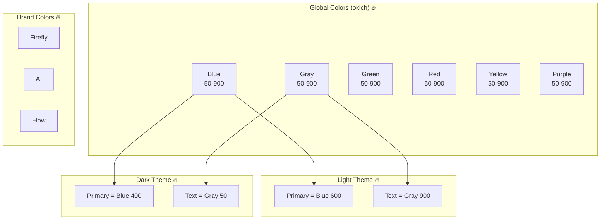
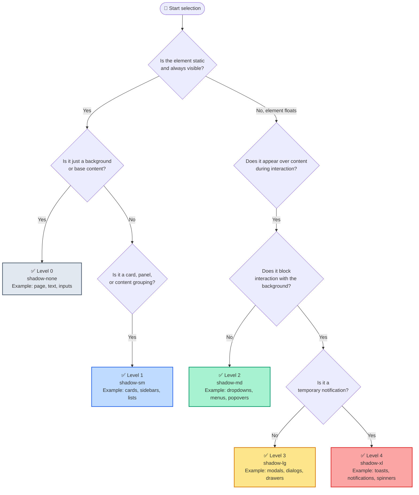

# @faf/foundations

> [RU](./README.ru.md) | [ENG](./README.md)

**The Foundation of the Faf Design System** — atomic values (tokens) that replace magic numbers and create a unified language for all components.

---

## 📁 Package Structure

```bash
packages/foundations/
├── src/
│   ├── examples/                         # 🔥 Usage examples
│   │   ├── typography-components.css     # Fluid typography CSS examples
│   │   └── typography-demo.html          # Interactive typography demo
│   ├── tokens/
│   │   ├── colors/
│   │   │   ├── index.ts                  # Export of all color tokens
│   │   │   ├── primitives.ts             # Base colors (oklch)
│   │   │   ├── brand.ts                  # Brand colors (firefly, ai, flow)
│   │   │   ├── light.ts                  # Light theme (semantics)
│   │   │   └── dark.ts                   # Dark theme (semantics)
│   │   ├── typography/
│   │   │   ├── index.ts                  # Export of typography tokens
│   │   │   ├── scales.ts                 # Modular scales (ratio 1.25)
│   │   │   ├── fluid.ts                  # Fluid typography (clamp)
│   │   │   ├── font-families.ts          # Font families
│   │   │   ├── font-weights.ts           # Font weights
│   │   │   ├── line-heights.ts           # Line heights
│   │   │   └── semantic.ts               # Semantic typography
│   │   ├── spacing/
│   │   │   ├── index.ts                  # Primitive spacing (4px base)
│   │   │   └── semantic.ts               # Semantic spacing
│   │   └── shadows/
│   │       ├── index.ts                  # Primitive shadows
│   │       └── semantic.ts               # Semantic shadows
│   ├── semantic/
│   │   ├── index.ts                      # Main semantic entry point
│   │   └── themes.ts                     # Theme contract (light/dark)
│   ├── styles/
│   │   ├── index.css                     # CSS entry point
│   │   └── tokens.generated.css          # ⚠️ Auto-generated file
│   ├── types/
│   │   └── tokens.d.ts                   # TypeScript types for CSS variables
│   └── index.ts                          # Main package entry point (imports CSS)
├── tests/                                # 🔥 Tests (Vitest)
│   ├── tokens.test.ts                    # Unit tests for specific values
│   └── token-contract.test.ts            # Contract tests for system integrity
├── viewer/                               # 🔥 Interactive viewer
│   ├── index.html                        # Viewer entry point
│   ├── styles.css                        # Viewer styles
│   └── tokens-viewer.js                  # Logic for category and theme switching
├── docs/                                 # 🔥 Documentation
│   ├── oklch-guide.md                    # Why we use oklch
│   ├── colors-guide.md                   # Contrast recommendations (WCAG)
│   └── tokens-guide.md                   # Guide to using tokens
├── dist/                                 # Build output (generated by `build` command)
│   ├── index.cjs
│   ├── index.d.ts
│   ├── index.js
│   └── tokens.css
├── package.json
├── tsconfig.json                         # TypeScript configuration
├── vite.config.ts                        # Vite configuration
└── README.md
```

---

## 🏗️ Architectural Diagrams

### 1. Design Token Hierarchy



### 2. Faf-Foundations Structure



### 3. Faf.Colors System



---

## 📦 Installation

```bash
# From the monorepo root (for local development)
pnpm install

# Or when used as an external dependency
pnpm add @faf/foundations
```

---

## 🚀 Quick Start

### Usage in TypeScript/JavaScript

```typescript
import { themes, semanticSpacing, semanticShadows } from "@faf/foundations";

// Colors from the light theme
const primaryColor = themes.light.primary; // oklch(0.55 0.22 250)
const textColor = themes.light.text; // oklch(0.20 0.03 250)

// Semantic spacing
const buttonPadding = semanticSpacing.buttonPaddingX; // 1rem (16px)
const cardPadding = semanticSpacing.cardPadding; // 1.5rem (24px)

// Semantic shadows
const cardShadow = semanticShadows.card; // 0 4px 6px rgba(0,0,0,0.1)
```

### Usage in CSS

```css
/* Import tokens via package export */
@import "@faf/foundations/styles";

.my-button {
  background-color: var(--faf-color-primary);
  color: var(--faf-color-surface);
  padding: var(--faf-spacing-button-padding-y)
    var(--faf-spacing-button-padding-x);
  box-shadow: var(--faf-shadow-button);
}

.my-card {
  padding: var(--faf-spacing-card-padding);
  box-shadow: var(--faf-shadow-card);
  background-color: var(--faf-color-surface);
  border: 1px solid var(--faf-color-border);
}
```

---

## 🏗️ Architecture: Primitives vs Semantics

### Primitives

**The complete set of "raw" values.** This is the ingredient pantry.

```typescript
// Example: all steps of the spacing scale
spacing[0]; // 0px
spacing[1]; // 0.25rem (4px)
spacing[2]; // 0.5rem (8px)
// ... up to spacing[16]
```

**Who uses it:** Any developer who needs a specific, non-standard spacing value.

### Semantic Tokens

**A subset of primitives with assigned roles.** This is the restaurant menu.

```typescript
// Example: only meaningful roles
semanticSpacing.buttonPaddingX; // 1rem
semanticSpacing.cardPadding; // 1.5rem
semanticSpacing.modalPadding; // 2rem
```

**Who uses it:** Design system components (buttons, cards, modals).

### Why doesn't semantics contain everything?

1. **Protection against bloat:** Semantics only contains meaningful combinations.
2. **Flexibility for edge cases:** If a non-standard spacing is needed, grab it directly from primitives.
3. **Change management:** Change `cardPadding` in one place → all cards update automatically.

---

## 🎨 Color System

### Themes (Light/Dark)

```typescript
import { themes } from "@faf/foundations";

// Light theme (default)
themes.light.primary; // oklch(0.55 0.22 250)
themes.light.background; // oklch(0.98 0.005 250)
themes.light.text; // oklch(0.20 0.03 250)

// Dark theme
themes.dark.primary; // oklch(0.70 0.15 250)
themes.dark.background; // oklch(0.20 0.03 250)
themes.dark.text; // oklch(0.98 0.005 250)
```

### Theme Switching

```html
<!-- Light theme (default) -->
<html data-theme="light">
  <!-- Dark theme -->
  <html data-theme="dark">
    <!-- System theme (automatically from OS) -->
    <html>
      <!-- without data-theme attribute -->
    </html>
  </html>
</html>
```

### Brand Colors

```typescript
import { themes } from "@faf/foundations";

themes.light.brandFirefly; // oklch(0.70 0.22 80)
themes.light.brandAi; // oklch(0.65 0.25 280)
themes.light.brandFlow; // oklch(0.60 0.20 200)
```

---

## 🔤 Typography

### Modular Scale (ratio: 1.25 — major third)

```typescript
import { typographyScale } from "@faf/foundations";

typographyScale[-2]; // 0.64rem (10.24px) — xs
typographyScale[-1]; // 0.8rem (12.8px) — sm
typographyScale[0]; // 1rem (16px) — base
typographyScale[1]; // 1.25rem (20px) — lg
typographyScale[2]; // 1.563rem (25px) — xl
typographyScale[3]; // 1.953rem (31.25px) — 2xl
typographyScale[4]; // 2.441rem (39.06px) — 3xl
```

### What is a modular scale?

It is a sequence of numbers where each subsequent number is obtained by multiplying the previous one by a constant coefficient (ratio). In our case, ratio = 1.25 (major third — a classic musical interval).

**Why is this needed:**

- Font sizes become harmonious and consistent.
- Easy to scale (multiply the base by the ratio).
- Used in Material Design, Tailwind, and Bootstrap.

### Fluid Typography (adaptive sizing)

```typescript
import { fluidSizes } from "@faf/foundations";

fluidSizes.sm; // clamp(0.875rem, 0.8rem + 0.25vw, 1rem)
fluidSizes.base; // clamp(1rem, 0.9rem + 0.33vw, 1.125rem)
fluidSizes.lg; // clamp(1.125rem, 1rem + 0.42vw, 1.25rem)
```

---

## 📏 Spacing

### Base Scale (4px base)

```typescript
import { spacing } from "@faf/foundations";

spacing[0]; // 0px
spacing[1]; // 0.25rem (4px)
spacing[2]; // 0.5rem (8px)
spacing[3]; // 0.75rem (12px)
spacing[4]; // 1rem (16px)
spacing[5]; // 1.25rem (20px)
spacing[6]; // 1.5rem (24px)
spacing[8]; // 2rem (32px)
spacing[10]; // 2.5rem (40px)
spacing[12]; // 3rem (48px)
spacing[16]; // 4rem (64px)
```

### Semantic Spacing

```typescript
import { semanticSpacing } from "@faf/foundations";

semanticSpacing.buttonPaddingX; // 1rem (16px)
semanticSpacing.buttonPaddingY; // 0.5rem (8px)
semanticSpacing.cardPadding; // 1.5rem (24px)
semanticSpacing.modalPadding; // 2rem (32px)
semanticSpacing.sectionGap; // 3rem (48px)
```

---

## 🌑 Shadows (Elevation System)

### Base Levels

```typescript
import { shadows } from "@faf/foundations";

shadows.none; // none
shadows.sm; // 0 1px 2px rgba(0,0,0,0.05)
shadows.md; // 0 4px 6px rgba(0,0,0,0.1)
shadows.lg; // 0 10px 15px rgba(0,0,0,0.1)
shadows.xl; // 0 20px 25px rgba(0,0,0,0.1)
```

### Semantic Shadows

```typescript
import { semanticShadows } from "@faf/foundations";

semanticShadows.button; // shadows.sm
semanticShadows.card; // shadows.md
semanticShadows.dropdown; // shadows.lg
semanticShadows.modal; // shadows.xl
semanticShadows.tooltip; // shadows.md
```

### 🌳 Elevation Decision Tree



### 📋 Additional Rules

| Level | Token  | When to use                                 | What to avoid                                 |
| ----- | ------ | ------------------------------------------- | --------------------------------------------- |
| **0** | `none` | Backgrounds, surfaces, text, inputs, tables | Do not use for interactive elements           |
| **1** | `sm`   | Cards, panels, sidebars, lists              | Do not use for floating elements              |
| **2** | `md`   | Dropdowns, menus, popovers, selects         | Do not use for elements that block the screen |
| **3** | `lg`   | Modals, dialogs, drawers                    | Do not use for temporary notifications        |
| **4** | `xl`   | Toasts, notifications, global spinners      | Do not use for static elements                |

---

## ⚙️ CSS Generation

### Automatic Generation

```bash
# From the monorepo root
pnpm run generate:tokens

# Or from a specific package
cd packages/foundations
pnpm run generate:tokens
```

_This will create/update the `src/styles/tokens.generated.css` file based on TypeScript tokens._

### Generation for All Packages

```bash
# From the monorepo root
pnpm run generate:all
```

---

## ❓ FAQ

### 1. Why do we use `rem` instead of `px`?

`rem` depends on the root element's (`html`) font size. This makes spacing scalable if the user changes their browser's default font size. In design systems, this is an accessibility (a11y) standard.

### 2. Why are spacing keys numbers, not strings like 'sm'?

A numeric scale is more flexible and aligns with the "base × multiplier" concept (4px, 8px, 12px...). This is a widely accepted pattern in modern design systems (Material Design, Tailwind).

### 3. What does `as const` mean in token code?

It is a TypeScript construct that tells the compiler: "this object will never change, and all its values are strict literals." This gives us perfect autocompletion and protects against typos in token names.

---

## 📝 License

MIT © Faf Design System

---
