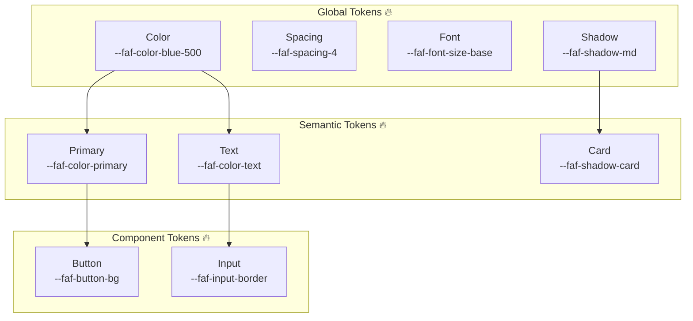
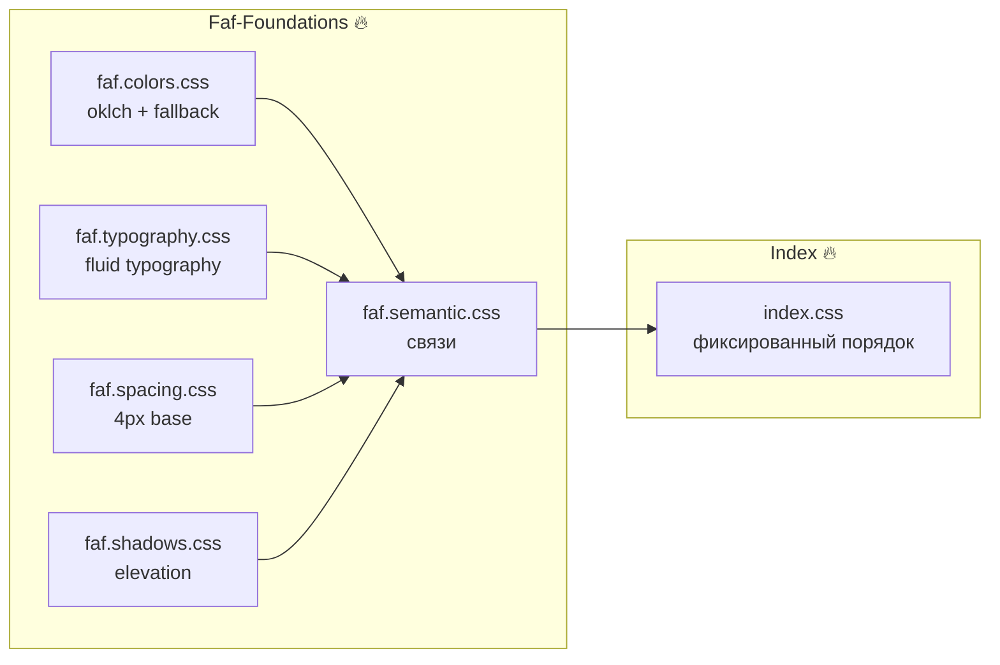
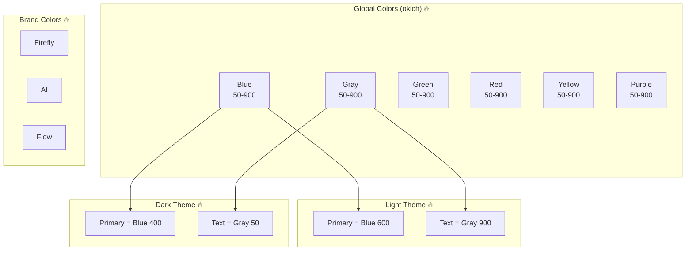
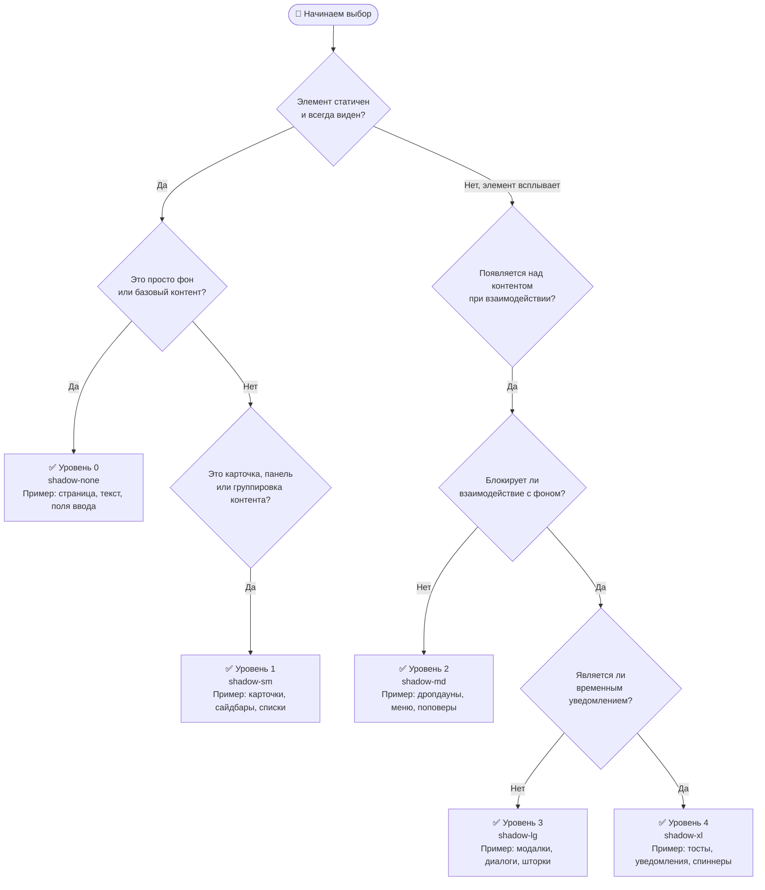

# @faf/foundations

> [RU](./README.ru.md) | [ENG](./README.md)

**Фундамент дизайн-системы Faf** — атомарные значения (токены), которые заменяют магические числа и создают единый язык для всех компонентов.

---

## 📁 Структура пакета

```bash
packages/foundations/
├── src/
│   ├── examples/                         # 🔥 Примеры использования
│   │   ├── typography-components.css     # Примеры fluid typography в CSS
│   │   └── typography-demo.html          # Интерактивное демо типографики
│   ├── tokens/
│   │   ├── colors/
│   │   │   ├── index.ts                  # Экспорт всех цветовых токенов
│   │   │   ├── primitives.ts             # Базовые цвета (oklch)
│   │   │   ├── brand.ts                  # Брендовые цвета (firefly, ai, flow)
│   │   │   ├── light.ts                  # Светлая тема (семантика)
│   │   │   └── dark.ts                   # Тёмная тема (семантика)
│   │   ├── typography/
│   │   │   ├── index.ts                  # Экспорт типографики
│   │   │   ├── scales.ts                 # Модульные шкалы (ratio 1.25)
│   │   │   ├── fluid.ts                  # Fluid typography (clamp)
│   │   │   ├── font-families.ts          # Семейства шрифтов
│   │   │   ├── font-weights.ts           # Начертания
│   │   │   ├── line-heights.ts           # Межстрочные интервалы
│   │   │   └── semantic.ts               # Семантическая типографика
│   │   ├── spacing/
│   │   │   ├── index.ts                  # Примитивные отступы (4px base)
│   │   │   └── semantic.ts               # Семантические отступы
│   │   └── shadows/
│   │       ├── index.ts                  # Примитивные тени
│   │       └── semantic.ts               # Семантические тени
│   ├── semantic/
│   │   ├── index.ts                      # Главная точка входа семантики
│   │   └── themes.ts                     # Контракт тем (light/dark)
│   ├── styles/
│   │   ├── index.css                     # Точка входа CSS
│   │   └── tokens.generated.css          # ⚠️ Автогенерируемый файл
│   ├── types/
│   │   └── tokens.d.ts                   # TypeScript-типы для CSS-переменных
│   └── index.ts                          # Главная точка входа пакета (импортирует CSS)
├── tests/                                # 🔥 Тесты (Vitest)
│   ├── tokens.test.ts                    # Unit-тесты конкретных значений
│   └── token-contract.test.ts            # Контрактные тесты целостности системы
├── viewer/                               # 🔥 Интерактивный viewer
│   ├── index.html                        # Точка входа viewer
│   ├── styles.css                        # Стили viewer
│   └── tokens-viewer.js                  # Логика переключения категорий и тем
├── docs/                                 # 🔥 Документация
│   ├── oklch-guide.md                    # Почему мы используем oklch
│   ├── colors-guide.md                   # Рекомендации по контрастности (WCAG)
│   └── tokens-guide.md                   # Руководство по использованию токенов
├── dist/                                 # Сборка (генерируется командой build)
│   ├── index.cjs
│   ├── index.d.ts
│   ├── index.js
│   └── tokens.css
├── package.json
├── tsconfig.json                         # TypeScript-конфигурация
├── vite.config.ts                        # Vite-конфигурация
└── README.md
```

---

## 🏗️ Архитектурные диаграммы

### 1. Иерархия дизайн-токенов



### 2. Структура Faf-Foundations



### 3. Цветовая система Faf.Colors



---

## 📦 Установка

```bash
# Из корня монорепозитория (для локальной разработки)
pnpm install

# Или при использовании как внешней зависимости
pnpm add @faf/foundations
```

---

## 🚀 Быстрый старт

### Использование в TypeScript/JavaScript

```typescript
import { themes, semanticSpacing, semanticShadows } from "@faf/foundations";

// Цвета из светлой темы
const primaryColor = themes.light.primary; // oklch(0.55 0.22 250)
const textColor = themes.light.text; // oklch(0.20 0.03 250)

// Семантические отступы
const buttonPadding = semanticSpacing.buttonPaddingX; // 1rem (16px)
const cardPadding = semanticSpacing.cardPadding; // 1.5rem (24px)

// Семантические тени
const cardShadow = semanticShadows.card; // 0 4px 6px rgba(0,0,0,0.1)
```

### Использование в CSS

```css
/* Подключаем токены через экспорт пакета */
@import "@faf/foundations/styles";

.my-button {
  background-color: var(--faf-color-primary);
  color: var(--faf-color-surface);
  padding: var(--faf-spacing-button-padding-y)
    var(--faf-spacing-button-padding-x);
  box-shadow: var(--faf-shadow-button);
}

.my-card {
  padding: var(--faf-spacing-card-padding);
  box-shadow: var(--faf-shadow-card);
  background-color: var(--faf-color-surface);
  border: 1px solid var(--faf-color-border);
}
```

---

## 🏗️ Архитектура: Примитивы vs Семантика

### Примитивы (Primitives)

**Полный набор "сырых" значений.** Это склад ингредиентов.

```typescript
// Пример: все шаги шкалы отступов
spacing[0]; // 0px
spacing[1]; // 0.25rem (4px)
spacing[2]; // 0.5rem (8px)
// ... до spacing[16]
```

**Кто использует:** Любой разработчик, которому нужен специфичный, нестандартный отступ.

### Семантика (Semantic Tokens)

**Подмножество примитивов с ролями.** Это меню ресторана.

```typescript
// Пример: только осмысленные роли
semanticSpacing.buttonPaddingX; // 1rem
semanticSpacing.cardPadding; // 1.5rem
semanticSpacing.modalPadding; // 2rem
```

**Кто использует:** Компоненты дизайн-системы (кнопки, карточки, модалки).

### Почему семантика НЕ содержит всё?

1. **Защита от раздувания:** Семантика содержит только осмысленные комбинации.
2. **Гибкость для edge-cases:** Если нужен нестандартный отступ, берите напрямую из примитивов.
3. **Управление изменениями:** Изменили `cardPadding` в одном месте → все карточки обновились.

---

## 🎨 Цветовая система

### Темы (Light/Dark)

```typescript
import { themes } from "@faf/foundations";

// Светлая тема (по умолчанию)
themes.light.primary; // oklch(0.55 0.22 250)
themes.light.background; // oklch(0.98 0.005 250)
themes.light.text; // oklch(0.20 0.03 250)

// Тёмная тема
themes.dark.primary; // oklch(0.70 0.15 250)
themes.dark.background; // oklch(0.20 0.03 250)
themes.dark.text; // oklch(0.98 0.005 250)
```

### Переключение темы

```html
<!-- Светлая тема (по умолчанию) -->
<html data-theme="light">
  <!-- Тёмная тема -->
  <html data-theme="dark">
    <!-- Системная тема (автоматически из ОС) -->
    <html>
      <!-- без атрибута data-theme -->
    </html>
  </html>
</html>
```

### Брендовые цвета

```typescript
import { themes } from "@faf/foundations";

themes.light.brandFirefly; // oklch(0.70 0.22 80)
themes.light.brandAi; // oklch(0.65 0.25 280)
themes.light.brandFlow; // oklch(0.60 0.20 200)
```

---

## 🔤 Типографика

### Modular Scale (ratio: 1.25 — major third)

```typescript
import { typographyScale } from "@faf/foundations";

typographyScale[-2]; // 0.64rem (10.24px) — xs
typographyScale[-1]; // 0.8rem (12.8px) — sm
typographyScale[0]; // 1rem (16px) — base
typographyScale[1]; // 1.25rem (20px) — lg
typographyScale[2]; // 1.563rem (25px) — xl
typographyScale[3]; // 1.953rem (31.25px) — 2xl
typographyScale[4]; // 2.441rem (39.06px) — 3xl
```

### Что такое modular scale?

Это последовательность чисел, где каждое следующее получается умножением предыдущего на постоянный коэффициент (ratio). В нашем случае ratio = 1.25 (major third — классическая музыкальная терция).

**Зачем это нужно:**

- Размеры шрифтов становятся гармоничными и согласованными.
- Легко масштабировать (умножаешь базу на ratio).
- Используется в Material Design, Tailwind, Bootstrap.

### Fluid Typography (адаптивные размеры)

```typescript
import { fluidSizes } from "@faf/foundations";

fluidSizes.sm; // clamp(0.875rem, 0.8rem + 0.25vw, 1rem)
fluidSizes.base; // clamp(1rem, 0.9rem + 0.33vw, 1.125rem)
fluidSizes.lg; // clamp(1.125rem, 1rem + 0.42vw, 1.25rem)
```

---

## 📏 Отступы

### Базовая шкала (4px base)

```typescript
import { spacing } from "@faf/foundations";

spacing[0]; // 0px
spacing[1]; // 0.25rem (4px)
spacing[2]; // 0.5rem (8px)
spacing[3]; // 0.75rem (12px)
spacing[4]; // 1rem (16px)
spacing[5]; // 1.25rem (20px)
spacing[6]; // 1.5rem (24px)
spacing[8]; // 2rem (32px)
spacing[10]; // 2.5rem (40px)
spacing[12]; // 3rem (48px)
spacing[16]; // 4rem (64px)
```

### Семантические отступы

```typescript
import { semanticSpacing } from "@faf/foundations";

semanticSpacing.buttonPaddingX; // 1rem (16px)
semanticSpacing.buttonPaddingY; // 0.5rem (8px)
semanticSpacing.cardPadding; // 1.5rem (24px)
semanticSpacing.modalPadding; // 2rem (32px)
semanticSpacing.sectionGap; // 3rem (48px)
```

---

## 🌑 Тени (Elevation System)

### Базовые уровни

```typescript
import { shadows } from "@faf/foundations";

shadows.none; // none
shadows.sm; // 0 1px 2px rgba(0,0,0,0.05)
shadows.md; // 0 4px 6px rgba(0,0,0,0.1)
shadows.lg; // 0 10px 15px rgba(0,0,0,0.1)
shadows.xl; // 0 20px 25px rgba(0,0,0,0.1)
```

### Семантические тени

```typescript
import { semanticShadows } from "@faf/foundations";

semanticShadows.button; // shadows.sm
semanticShadows.card; // shadows.md
semanticShadows.dropdown; // shadows.lg
semanticShadows.modal; // shadows.xl
semanticShadows.tooltip; // shadows.md
```

### 🌳 Алгоритм выбора уровня тени (Elevation Decision Tree)



### 📋 Дополнительные правила

| Уровень | Токен  | Когда использовать                       | Чего избегать                                         |
| ------- | ------ | ---------------------------------------- | ----------------------------------------------------- |
| **0**   | `none` | Фон, поверхности, текст, инпуты, таблицы | Не используйте для интерактивных элементов            |
| **1**   | `sm`   | Карточки, панели, сайдбары, списки       | Не используйте для всплывающих элементов              |
| **2**   | `md`   | Дропдауны, меню, поповеры, селекты       | Не используйте для элементов, которые блокируют экран |
| **3**   | `lg`   | Модалки, диалоги, шторки (drawer)        | Не используйте для временных уведомлений              |
| **4**   | `xl`   | Тосты, нотификации, глобальные спиннеры  | Не используйте для статичных элементов                |

---

## ⚙️ Генерация CSS

### Автоматическая генерация

```bash
# Из корня монорепозитория
pnpm run generate:tokens

# Или из конкретного пакета
cd packages/foundations
pnpm run generate:tokens
```

_Это создаст/обновит файл `src/styles/tokens.generated.css` на основе TypeScript-токенов._

### Генерация для всех пакетов

```bash
# Из корня монорепозитория
pnpm run generate:all
```

---

## ❓ FAQ

### 1. Почему мы используем rem, а не px?

`rem` зависит от размера шрифта корневого элемента (`html`). Это делает отступы масштабируемыми, если пользователь меняет размер шрифта в настройках браузера. В дизайн-системах это стандарт доступности (a11y).

### 2. Почему ключи отступов — числа, а не строки типа 'sm'?

Числовая шкала более гибкая и соответствует концепции «база × множитель» (4px, 8px, 12px...). Это общепринятый паттерн в современных дизайн-системах (Material Design, Tailwind).

### 3. Что значит `as const` в коде токенов?

Это TypeScript-конструкция, которая говорит компилятору: «этот объект никогда не изменится, и все его значения — строгие литералы». Это даёт нам идеальное автодополнение и защиту от опечаток в названиях токенов.

---

## 📝 Лицензия

MIT © Faf Design System

---
