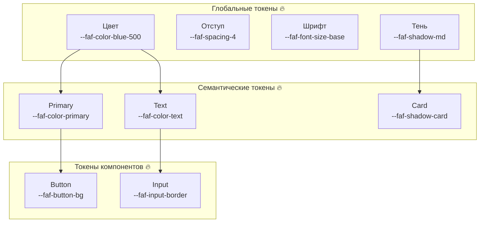
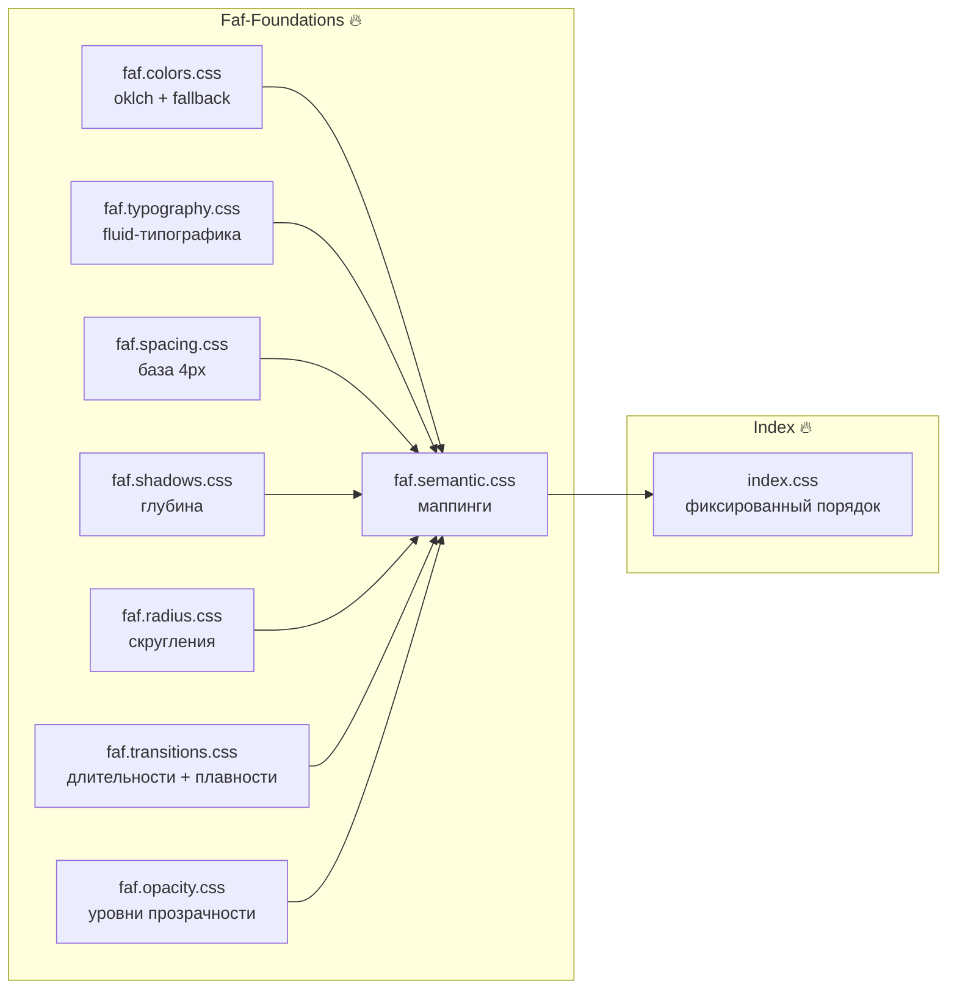
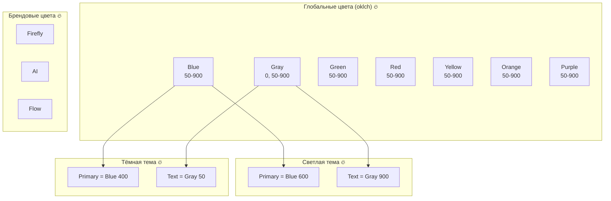
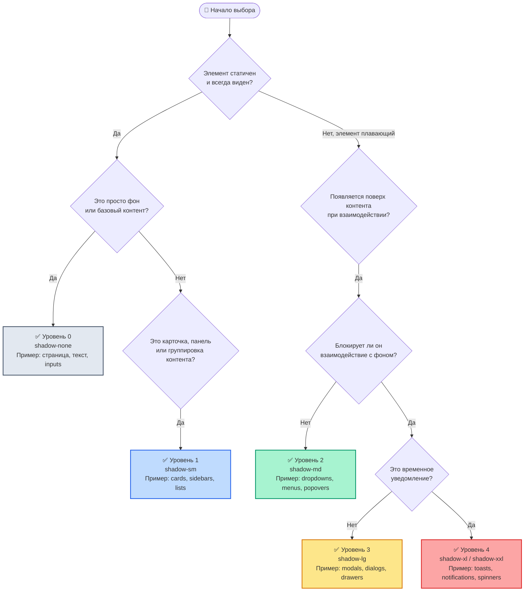

# @faf/foundations

> [RU](./README.ru.md) | [ENG](./README.md)

**Фундамент Faf Design System** — атомарные значения (токены), которые заменяют магические числа и создают единый язык для всех компонентов.

---

## 📁 Структура пакета

```bash
packages/foundations/
├── src/
│   ├── examples/                         # 🔥 Примеры использования
│   │   ├── typography-components.css     # Примеры CSS fluid-типографики
│   │   └── typography-demo.html          # Интерактивное демо типографики
│   ├── tokens/
│   │   ├── colors/
│   │   │   ├── index.ts                  # Экспорт всех цветовых токенов
│   │   │   ├── primitives.ts             # Базовые цвета (oklch)
│   │   │   ├── brand.ts                  # Брендовые цвета (firefly, ai, flow)
│   │   │   ├── light.ts                  # Светлая тема (семантика)
│   │   │   └── dark.ts                   # Тёмная тема (семантика)
│   │   ├── typography/
│   │   │   ├── index.ts                  # Экспорт токенов типографики
│   │   │   ├── scales.ts                 # Модульные шкалы (коэффициент 1.25)
│   │   │   ├── fluid.ts                  # Fluid-типографика (clamp)
│   │   │   ├── font-families.ts          # Семейства шрифтов
│   │   │   ├── font-weights.ts           # Насыщенности шрифтов
│   │   │   ├── line-heights.ts           # Межстрочные интервалы
│   │   │   └── semantic.ts               # Семантическая типографика
│   │   ├── spacing/
│   │   │   ├── index.ts                  # Агрегированные экспорты
│   │   │   ├── spacing.ts                # Примитивные отступы (база 4px)
│   │   │   └── semantic.ts               # Семантические отступы
│   │   ├── shadows/
│   │   │   ├── index.ts                  # Агрегированные экспорты
│   │   │   ├── shadows.ts                # Примитивные тени
│   │   │   └── semantic.ts               # Семантические тени
│   │   ├── radius/
│   │   │   ├── index.ts                  # Агрегированные экспорты
│   │   │   ├── radii.ts                  # Примитивные скругления
│   │   │   └── semantic.ts               # Семантические скругления
│   │   ├── transitions/
│   │   │   ├── index.ts                  # Агрегированные экспорты
│   │   │   ├── transitions.ts            # Примитивные длительности и функции плавности
│   │   │   └── semantic.ts               # Семантические переходы
│   │   └── opacity/
│   │       ├── index.ts                  # Агрегированные экспорты
│   │       ├── opacity.ts                # Примитивная прозрачность
│   │       └── semantic.ts               # Семантическая прозрачность
│   ├── semantic/
│   │   ├── index.ts                      # Главная точка входа семантики
│   │   └── themes.ts                     # Контракт тем (light/dark)
│   ├── styles/
│   │   ├── index.css                     # Точка входа CSS
│   │   └── tokens.generated.css          # ⚠️ Автогенерируемый файл
│   ├── types/
│   │   ├── tokens.d.ts                   # TypeScript-типы для CSS-переменных
│   │   └── react.d.ts                    # Расширение React CSSProperties
│   └── index.ts                          # Главная точка входа пакета (импортирует CSS)
├── tests/                                # 🔥 Тесты (Vitest)
│   ├── tokens.test.ts                    # Unit-тесты конкретных значений
│   └── token-contract.test.ts            # Контрактные тесты целостности системы
├── viewer/                               # 🔥 Интерактивный просмотрщик
│   ├── index.html                        # Точка входа просмотрщика
│   ├── styles.css                        # Стили просмотрщика
│   └── tokens-viewer.js                  # Логика переключения категорий и тем
├── docs/                                 # 🔥 Документация
│   ├── colors-guide.md                   # Руководство по системе цветов
│   ├── colors-guide.ru.md                # Руководство по системе цветов (RU)
│   ├── oklch-guide.md                    # Почему мы используем oklch
│   ├── oklch-guide.ru.md                 # Почему мы используем oklch (RU)
│   ├── tokens-guide.md                   # Руководство по использованию токенов
│   └── tokens-guide.ru.md                # Руководство по использованию токенов (RU)
├── dist/                                 # Результат сборки (генерируется командой `build`)
│   ├── index.cjs
│   ├── index.d.ts
│   ├── index.js
│   └── tokens.css
├── package.json
├── tsconfig.json                         # Конфигурация TypeScript
├── vite.config.ts                        # Конфигурация Vite
└── README.md
```

---

## 🏗️ Архитектурные диаграммы

### 1. Иерархия дизайн-токенов



### 2. Структура Faf-Foundations



### 3. Система Faf.Colors



---

## 📦 Установка

```bash
# Из корня монорепозитория (для локальной разработки)
pnpm install

# Или при использовании как внешнюю зависимость
pnpm add @faf/foundations
```

---

## 🚀 Быстрый старт

### Использование в TypeScript/JavaScript

```typescript
import {
  themes,
  semanticSpacing,
  semanticShadows,
  semanticRadius,
  semanticTransitions,
  semanticTypography,
} from "@faf/foundations";

// Цвета из светлой темы
const primaryColor = themes.light.primary; // oklch(0.55 0.22 250)
const textColor = themes.light.text; // oklch(0.20 0.03 250)

// Семантические отступы и радиусы
const buttonPadding = semanticSpacing.buttonPaddingX; // 1rem (16px)
const buttonRadius = semanticRadius.button; // 0.25rem (4px)

// Семантические тени и переходы
const cardShadow = semanticShadows.card; // 0 4px 6px rgba(0,0,0,0.1)
const defaultTransition = semanticTransitions.default; // 250ms cubic-bezier(0, 0, 0.2, 1)

// Семантическая типографика
const h1Style = semanticTypography.heading.h1;
```

### Использование в CSS

```css
/* Импорт токенов через экспорт пакета */
@import "@faf/foundations/styles";

.my-button {
  background-color: var(--faf-color-primary);
  color: var(--faf-color-surface);
  padding: var(--faf-spacing-button-padding-y)
    var(--faf-spacing-button-padding-x);
  border-radius: var(--faf-radius-button);
  box-shadow: var(--faf-shadow-button);
  transition: var(--faf-transition-color);
}

.my-card {
  padding: var(--faf-spacing-card-padding);
  box-shadow: var(--faf-shadow-card);
  background-color: var(--faf-color-surface);
  border: 1px solid var(--faf-color-border);
}
```

---

## 🏗️ Архитектура: Примитивы против Семантики

### Примитивы

**Полный набор "сырых" значений.** Это кладовая ингредиентов.

```typescript
// Пример: все шаги шкалы отступов
spacing[0]; // 0px
spacing[1]; // 0.25rem (4px)
spacing[2]; // 0.5rem (8px)
// ... вплоть до spacing[16]
```

**Кто использует:** Любой разработчик, которому нужно конкретное нестандартное значение отступа.

### Семантические токены

**Подмножество примитивов с назначенными ролями.** Это меню ресторана.

```typescript
// Пример: только осмысленные роли
semanticSpacing.buttonPaddingX; // 1rem
semanticSpacing.cardPadding; // 1.5rem
semanticSpacing.modalPadding; // 2rem
```

**Кто использует:** Компоненты дизайн-системы (кнопки, карточки, модалки).

### Почему семантика не содержит всё?

1. **Защита от раздувания:** Семантика содержит только осмысленные комбинации.
2. **Гибкость для крайних случаев:** Если нужен нестандартный отступ, берём его напрямую из примитивов.
3. **Управление изменениями:** Меняем `cardPadding` в одном месте → все карточки обновляются автоматически.

---

## 🎨 Система цветов

### Темы (Light/Dark)

```typescript
import { themes } from "@faf/foundations";

// Светлая тема (по умолчанию)
themes.light.primary; // oklch(0.55 0.22 250)
themes.light.background; // oklch(0.98 0.005 250)
themes.light.text; // oklch(0.20 0.03 250)

// Тёмная тема
themes.dark.primary; // oklch(0.70 0.15 250)
themes.dark.background; // oklch(0.20 0.03 250)
themes.dark.text; // oklch(0.98 0.005 250)
```

### Переключение тем

```html
<!-- Светлая тема (по умолчанию) -->
<html data-theme="light">
  <!-- Тёмная тема -->
  <html data-theme="dark">
    <!-- Системная тема (автоматически из ОС) -->
    <html>
      <!-- без атрибута data-theme -->
    </html>
  </html>
</html>
```

### Брендовые цвета

```typescript
import { themes } from "@faf/foundations";

themes.light.brandFirefly; // oklch(0.70 0.22 80)
themes.light.brandAi; // oklch(0.65 0.25 280)
themes.light.brandFlow; // oklch(0.60 0.20 200)
```

---

## 🔤 Типографика

### Модульная шкала (коэффициент: 1.25 — большая терция)

| Шаг  | CSS Переменная        | Значение (rem) | Значение (px) | Семантическое имя |
| :--- | :-------------------- | :------------- | :------------ | :---------------- |
| `-2` | `--faf-font-scale--2` | `0.64rem`      | `10.24px`     | `xs`              |
| `-1` | `--faf-font-scale--1` | `0.8rem`       | `12.8px`      | `sm`              |
| `0`  | `--faf-font-scale-0`  | `1rem`         | `16px`        | `base`            |
| `1`  | `--faf-font-scale-1`  | `1.25rem`      | `20px`        | `lg`              |
| `2`  | `--faf-font-scale-2`  | `1.563rem`     | `25px`        | `xl`              |
| `3`  | `--faf-font-scale-3`  | `1.953rem`     | `31.25px`     | `2xl`             |
| `4`  | `--faf-font-scale-4`  | `2.441rem`     | `39.06px`     | `3xl`             |

### Что такое модульная шкала?

Это последовательность чисел, где каждое последующее получается умножением предыдущего на постоянный коэффициент (ratio). В нашем случае ratio = 1.25 (большая терция — классический музыкальный интервал).

**Зачем это нужно:**

- Размеры шрифтов становятся гармоничными и согласованными.
- Легко масштабировать (умножаем базу на коэффициент).
- Используется в Material Design, Tailwind и Bootstrap.

### Fluid-типографика (адаптивные размеры)

| Ключ   | CSS Переменная         | Значение (clamp)                          | Минимум    | Предпочтительное  | Максимум   |
| :----- | :--------------------- | :---------------------------------------- | :--------- | :---------------- | :--------- |
| `sm`   | `--faf-font-size-sm`   | `clamp(0.875rem, 0.8rem + 0.25vw, 1rem)`  | `0.875rem` | `0.8rem + 0.25vw` | `1rem`     |
| `base` | `--faf-font-size-base` | `clamp(1rem, 0.9rem + 0.33vw, 1.125rem)`  | `1rem`     | `0.9rem + 0.33vw` | `1.125rem` |
| `lg`   | `--faf-font-size-lg`   | `clamp(1.125rem, 1rem + 0.42vw, 1.25rem)` | `1.125rem` | `1rem + 0.42vw`   | `1.25rem`  |
| `xl`   | `--faf-font-size-xl`   | `clamp(1.25rem, 1.1rem + 0.5vw, 1.5rem)`  | `1.25rem`  | `1.1rem + 0.5vw`  | `1.5rem`   |
| `2xl`  | `--faf-font-size-2xl`  | `clamp(1.5rem, 1.3rem + 0.67vw, 2rem)`    | `1.5rem`   | `1.3rem + 0.67vw` | `2rem`     |
| `3xl`  | `--faf-font-size-3xl`  | `clamp(1.875rem, 1.5rem + 1.25vw, 3rem)`  | `1.875rem` | `1.5rem + 1.25vw` | `3rem`     |

---

## 📏 Отступы

### Базовая шкала (база 4px)

| Ключ | CSS Переменная     | Значение         |
| :--- | :----------------- | :--------------- |
| `0`  | `--faf-spacing-0`  | `0px`            |
| `1`  | `--faf-spacing-1`  | `0.25rem` (4px)  |
| `2`  | `--faf-spacing-2`  | `0.5rem` (8px)   |
| `3`  | `--faf-spacing-3`  | `0.75rem` (12px) |
| `4`  | `--faf-spacing-4`  | `1rem` (16px)    |
| `5`  | `--faf-spacing-5`  | `1.25rem` (20px) |
| `6`  | `--faf-spacing-6`  | `1.5rem` (24px)  |
| `8`  | `--faf-spacing-8`  | `2rem` (32px)    |
| `10` | `--faf-spacing-10` | `2.5rem` (40px)  |
| `12` | `--faf-spacing-12` | `3rem` (48px)    |
| `16` | `--faf-spacing-16` | `4rem` (64px)    |

### Семантические отступы

| Роль               | CSS-переменная                     | Значение  | Назначение                           |
| :----------------- | :--------------------------------- | :-------- | :----------------------------------- |
| `buttonPaddingX`   | `--faf-spacing-button-padding-x`   | `1rem`    | Горизонтальный отступ кнопки         |
| `buttonPaddingY`   | `--faf-spacing-button-padding-y`   | `0.5rem`  | Вертикальный отступ кнопки           |
| `buttonGap`        | `--faf-spacing-button-gap`         | `0.5rem`  | Зазор между иконкой и текстом кнопки |
| `inputPaddingX`    | `--faf-spacing-input-padding-x`    | `0.75rem` | Горизонтальный отступ поля ввода     |
| `inputPaddingY`    | `--faf-spacing-input-padding-y`    | `0.5rem`  | Вертикальный отступ поля ввода       |
| `cardPadding`      | `--faf-spacing-card-padding`       | `1.5rem`  | Внутренний отступ карточки           |
| `modalPadding`     | `--faf-spacing-modal-padding`      | `2rem`    | Отступ модального окна               |
| `tooltipPadding`   | `--faf-spacing-tooltip-padding`    | `0.5rem`  | Отступ подсказки                     |
| `drawerPadding`    | `--faf-spacing-drawer-padding`     | `1.5rem`  | Отступ выдвижной панели              |
| `toastPadding`     | `--faf-spacing-toast-padding`      | `1rem`    | Отступ уведомления (toast)           |
| `alertPadding`     | `--faf-spacing-alert-padding`      | `1rem`    | Отступ предупреждения (alert)        |
| `sectionGap`       | `--faf-spacing-section-gap`        | `3rem`    | Зазор между основными секциями       |
| `containerPadding` | `--faf-spacing-container-padding`  | `1rem`    | Горизонтальный отступ контейнера     |
| `gridGap`          | `--faf-spacing-grid-gap`           | `1rem`    | Зазор сетки (grid)                   |
| `sidebarGap`       | `--faf-spacing-sidebar-gap`        | `1rem`    | Зазор боковой панели                 |
| `tableCellPadding` | `--faf-spacing-table-cell-padding` | `0.75rem` | Отступ ячейки таблицы                |

---

## 🌑 Тени (Система возвышений)

### Базовые уровни

| Ключ   | CSS Переменная      | Значение                       |
| :----- | :------------------ | :----------------------------- |
| `none` | `--faf-shadow-none` | `none`                         |
| `sm`   | `--faf-shadow-sm`   | `0 1px 2px rgba(0,0,0,0.05)`   |
| `md`   | `--faf-shadow-md`   | `0 4px 6px rgba(0,0,0,0.1)`    |
| `lg`   | `--faf-shadow-lg`   | `0 10px 15px rgba(0,0,0,0.1)`  |
| `xl`   | `--faf-shadow-xl`   | `0 20px 25px rgba(0,0,0,0.1)`  |
| `xxl`  | `--faf-shadow-xxl`  | `0 25px 50px rgba(0,0,0,0.15)` |

### Семантические тени

| Роль                | CSS-переменная                    | Ссылки        | Назначение                        |
| :------------------ | :-------------------------------- | :------------ | :-------------------------------- |
| `button`            | `--faf-shadow-button`             | `shadows.sm`  | Интерактивные кнопки              |
| `card`              | `--faf-shadow-card`               | `shadows.md`  | Стандартные карточки              |
| `dropdown`          | `--faf-shadow-dropdown`           | `shadows.lg`  | Меню, popover-элементы            |
| `modal`             | `--faf-shadow-modal`              | `shadows.xl`  | Диалоги, выдвижные панели         |
| `tooltip`           | `--faf-shadow-tooltip`            | `shadows.md`  | Подсказки                         |
| `drawer`            | `--faf-shadow-drawer`             | `shadows.lg`  | Боковые выдвижные панели          |
| `toast`             | `--faf-shadow-toast`              | `shadows.xl`  | Уведомления (toast)               |
| `fullscreenOverlay` | `--faf-shadow-fullscreen-overlay` | `shadows.xxl` | Критические оверлеи на весь экран |
| `none`              | `--faf-shadow-none`               | `none`        | Сброс тени                        |

### 🌳 Дерево принятия решений по возвышениям



### 📋 Дополнительные правила

| Уровень | Токен  | Когда использовать                         | Чего избегать                                        |
| ------- | ------ | ------------------------------------------ | ---------------------------------------------------- |
| **0**   | `none` | Фоны, поверхности, текст, инпуты, таблицы  | Не использовать для интерактивных элементов          |
| **1**   | `sm`   | Карточки, панели, сайдбары, списки         | Не использовать для плавающих элементов              |
| **2**   | `md`   | Dropdowns, меню, поповеры, селекты         | Не использовать для элементов, блокирующих экран     |
| **3**   | `lg`   | Модалки, диалоги, дроверы                  | Не использовать для временных уведомлений            |
| **4**   | `xl`   | Тосты, уведомления, глобальные спиннеры    | Не использовать для статичных элементов              |
| **5**   | `xxl`  | Полноэкранные оверлеи, критические модалки | Использовать редко, только для максимального акцента |

---

## 🎯 Скругления (Border Radius)

### Базовые уровни

| Ключ   | CSS Переменная      | Значение         | Назначение                   |
| :----- | :------------------ | :--------------- | :--------------------------- |
| `none` | `--faf-radius-none` | `0px`            | Без скругления               |
| `xs`   | `--faf-radius-xs`   | `0.125rem` (2px) | Минимальное (иконки, бейджи) |
| `sm`   | `--faf-radius-sm`   | `0.25rem` (4px)  | Маленькое (кнопки, инпуты)   |
| `md`   | `--faf-radius-md`   | `0.5rem` (8px)   | Стандартное (карточки)       |
| `lg`   | `--faf-radius-lg`   | `0.75rem` (12px) | Большое (модалки)            |
| `xl`   | `--faf-radius-xl`   | `1rem` (16px)    | Максимальное                 |
| `xxl`  | `--faf-radius-xxl`  | `2rem` (32px)    | Двойное максимальное         |
| `full` | `--faf-radius-full` | `9999px`         | Полное скругление (pill)     |

### Семантические скругления

| Роль        | CSS Переменная           | Ссылка       | Назначение               |
| :---------- | :----------------------- | :----------- | :----------------------- |
| `none`      | `--faf-radius-none`      | `radii.none` | Таблицы, разделители     |
| `icon`      | `--faf-radius-icon`      | `radii.xs`   | Иконки, маленькие бейджи |
| `button`    | `--faf-radius-button`    | `radii.sm`   | Кнопки                   |
| `input`     | `--faf-radius-input`     | `radii.sm`   | Поля ввода               |
| `card`      | `--faf-radius-card`      | `radii.md`   | Карточки, панели         |
| `modal`     | `--faf-radius-modal`     | `radii.lg`   | Модальные окна, дроверы  |
| `container` | `--faf-radius-container` | `radii.xl`   | Большие контейнеры       |
| `hero`      | `--faf-radius-hero`      | `radii.xxl`  | Hero-секции              |
| `badge`     | `--faf-radius-badge`     | `radii.full` | Pill-бейджи              |

---

## ⚡ Переходы (Transitions)

### Длительности

| Ключ   | CSS Переменная        | Значение | Назначение                   |
| :----- | :-------------------- | :------- | :--------------------------- |
| `fast` | `--faf-duration-fast` | `150ms`  | Быстрые (hover, color)       |
| `base` | `--faf-duration-base` | `250ms`  | Стандартные (default)        |
| `slow` | `--faf-duration-slow` | `350ms`  | Медленные (transform, modal) |

### Функции плавности

| Ключ        | CSS Переменная             | Значение                       | Назначение    |
| :---------- | :------------------------- | :----------------------------- | :------------ |
| `easeOut`   | `--faf-easing-ease-out`    | `cubic-bezier(0, 0, 0.2, 1)`   | Для появления |
| `easeInOut` | `--faf-easing-ease-in-out` | `cubic-bezier(0.4, 0, 0.2, 1)` | Универсальные |

### Семантические переходы

| Роль        | CSS Переменная               | Состав               | Назначение                                |
| :---------- | :--------------------------- | :------------------- | :---------------------------------------- |
| `default`   | `--faf-transition-default`   | `base` + `easeOut`   | Стандартные взаимодействия (hover, focus) |
| `color`     | `--faf-transition-color`     | `fast` + `easeOut`   | Быстрые изменения (цвет, фон)             |
| `transform` | `--faf-transition-transform` | `slow` + `easeInOut` | Медленные движения (модалки, дроверы)     |

---

## 👁️ Прозрачность (Opacity)

### Базовые уровни

| Ключ  | CSS Переменная      | Значение | Назначение                  |
| :---- | :------------------ | :------- | :-------------------------- |
| `0`   | `--faf-opacity-0`   | `0`      | Полностью прозрачный        |
| `25`  | `--faf-opacity-25`  | `0.25`   | Лёгкая прозрачность         |
| `50`  | `--faf-opacity-50`  | `0.5`    | Средняя (disabled, overlay) |
| `75`  | `--faf-opacity-75`  | `0.75`   | Лёгкая непрозрачность       |
| `100` | `--faf-opacity-100` | `1`      | Полностью непрозрачный      |

### Семантическая прозрачность

| Роль          | CSS Переменная              | Ссылка        | Назначение          |
| :------------ | :-------------------------- | :------------ | :------------------ |
| `disabled`    | `--faf-opacity-disabled`    | `opacity[50]` | Неактивные элементы |
| `overlay`     | `--faf-opacity-overlay`     | `opacity[75]` | Затемнение фона     |
| `placeholder` | `--faf-opacity-placeholder` | `opacity[25]` | Плейсхолдеры        |

---

## ⚙️ Генерация CSS

### Автоматическая генерация

```bash
# Из корня монорепозитория
pnpm run generate:tokens

# Или из конкретного пакета
cd packages/foundations
pnpm run generate:tokens
```

_Это создаст/обновит файл `src/styles/tokens.generated.css` на основе TypeScript-токенов._

### Генерация для всех пакетов

```bash
# Из корня монорепозитория
pnpm run generate:all
```

---

## ❓ FAQ

### 1. Почему мы используем `rem` вместо `px`?

`rem` зависит от размера шрифта корневого элемента (`html`). Это делает отступы масштабируемыми, если пользователь изменяет размер шрифта по умолчанию в браузере. В дизайн-системах это стандарт доступности (a11y).

### 2. Почему ключи отступов — числа, а не строки типа 'sm'?

Числовая шкала более гибкая и соответствует концепции "база × множитель" (4px, 8px, 12px...). Это общепринятый паттерн в современных дизайн-системах (Material Design, Tailwind).

### 3. Что означает `as const` в коде токенов?

Это конструкция TypeScript, которая говорит компилятору: "этот объект никогда не изменится, и все его значения — строгие литералы". Это даёт нам идеальное автодополнение и защищает от опечаток в именах токенов.

---

## 📝 Лицензия

MIT © Faf Design System

---
