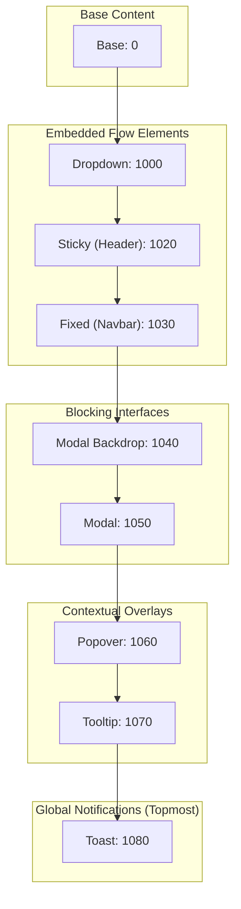
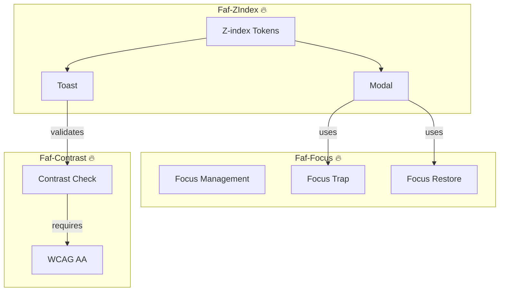
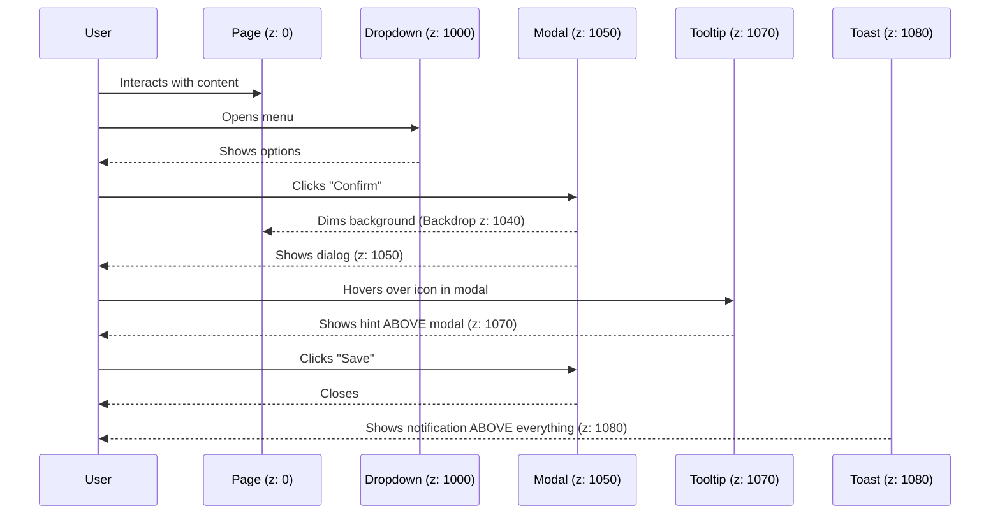
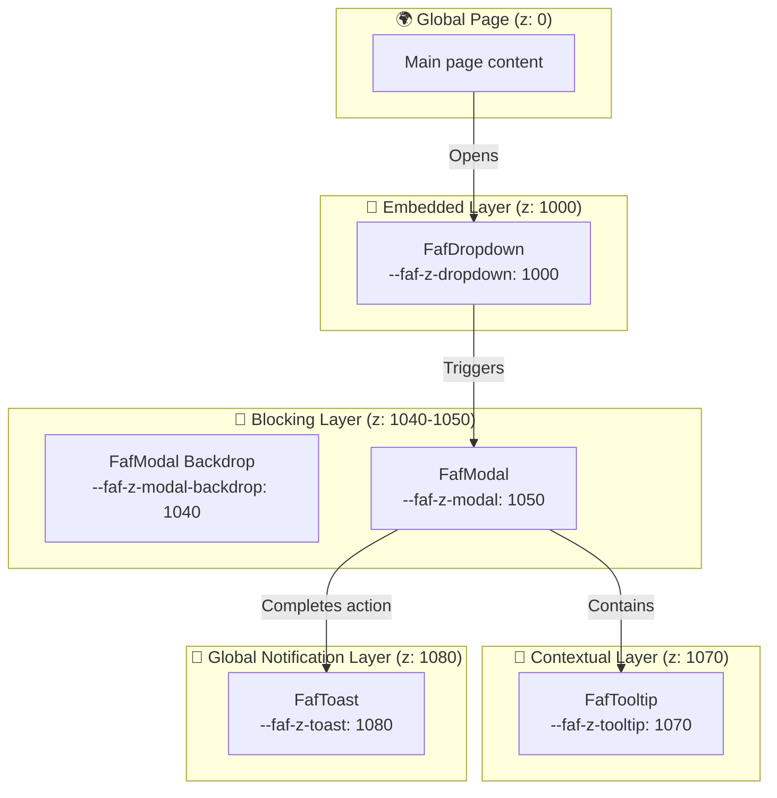

# @faf/z-index

> [EN](./README.md) | [RU](./README.ru.md)

**Layer Management System for the Faf Design System** — provides named z-index tokens instead of magic numbers, along with reference UI pattern implementations that guarantee correct stacking context behavior and accessibility (a11y) rules.

---

## 📁 Package Structure

```bash
packages/z-index/
├── src/
│   ├── tokens/
│   │   ├── index.ts                  # Token and type exports
│   │   └── zindex.ts                 # 🔥 SSOT: Named z-index values
│   ├── patterns/
│   │   ├── faf.modal.ts              # 🔥 Modal (1040/1050 + Focus Trap)
│   │   ├── faf.toast.ts              # 🔥 Toast (1080 + Contrast Check)
│   │   ├── faf.dropdown.ts           # 🔥 Dropdown (1000 + Keyboard Nav)
│   │   └── faf.tooltip.ts            # 🔥 Tooltip (1070 + Hover/Focus)
│   ├── utils/
│   │   ├── focus.ts                  # Helper for Focus Trap
│   │   └── contrast.ts               # Helper for contrast validation
│   ├── styles/
│   │   └── tokens.generated.css      # ⚠️ Auto-generated CSS from zindex.ts
│   └── index.ts                      # Main package entry point
├── tests/                            # 🔥 Tests
│   ├── zindex-tokens.test.ts         # Unit tests for token contract (Vitest)
│   ├── contrast.test.ts              # Unit tests for contrast utility (Vitest)
│   └── patterns.spec.ts              # E2E tests for stacking context (Playwright)
├── viewer/                           # 🔥 Interactive documentation
│   ├── index.html                    # Viewer entry point
│   ├── styles.css                    # Viewer styles (with theme support)
│   └── viewer.js                     # Category switching and demo logic
├── docs/                             # 🔥 Additional documentation
├── dist/                             # Build output
├── package.json
├── tsconfig.json                     # TypeScript configuration
├── vite.config.ts                    # Vite configuration
├── vitest.config.ts                  # Unit tests configuration
└── playwright.config.ts              # E2E tests configuration
```

---

## 🏗️ Architectural Diagrams

### 1. Layer Hierarchy



### 2. Ecosystem Integration



### 3. Layer System: Interaction Scenario (Sequence)



### 4. Layer System: Visual Stack (Flowchart)



---

## 📦 Installation

```bash
# From monorepo root (local development)
pnpm install

# Or as an external dependency
pnpm add @faf/z-index
```

---

## 🚀 Quick Start

### Using Tokens in CSS

```css
@import "@faf/z-index/styles";

.my-custom-modal {
  position: fixed;
  /* 🔥 Use token instead of magic number */
  z-index: var(--faf-z-modal);
  background: var(--faf-color-surface); /* From @faf/foundations */
}
```

### Using Patterns in TypeScript / HTML

```typescript
import { zIndexTokens, FafModal } from "@faf/z-index";

// 1. Check token value
console.log(zIndexTokens.toast); // 1080

// 2. Use Web Component pattern
const modal = document.createElement("faf-modal");
modal.innerHTML = `
  <span slot="title">Confirmation</span>
  <p>Are you sure?</p>
`;
document.body.appendChild(modal);

// Open modal (automatically activates Focus Trap)
modal.open();
```

---

## 🏗️ Architecture: Tokens & Patterns (FAF Styling Contract)

### Z-index Tokens (Layer Contract)

This is the **Single Source of Truth (SSOT)** for `z-index` values. It prevents magic numbers (like `9999`) and guarantees a mathematically correct stacking hierarchy.

### Reference Patterns

Patterns are included here to serve three engineering purposes:

1. **Validation:** Proves tokens work correctly in the real DOM stacking context.
2. **Living Documentation:** Shows developers exactly how to apply tokens with a11y rules.
3. **Ready-to-use Components:** Can be used as-is, guaranteeing Layer Contract compliance.

**Strict adherence to FAF Web Components Styling Contract:**

- **Encapsulation:** Each component manages structure and local states (`:hover`, `:focus`) inside Shadow DOM.
- **Theming:** Built on CSS custom properties `--faf-*`, which inherit through the shadow boundary.
- **Context:** `:host-context()` is allowed **ONLY** for context-aware token mapping (e.g., dark mode), never for duplicating state logic.
- **Slots:** `::slotted()` is used ONLY for simple styling of projected content, without complex hover/focus scenarios (child components handle this via their own Shadow DOM).
- **Local Variables:** Local variables like `--item-hover-bg` are permitted if they map directly to global tokens.

---

## 📐 Layer Contract

| Token                    | Value  | Purpose              | Example                      |
| :----------------------- | :----- | :------------------- | :--------------------------- |
| `--faf-z-base`           | `0`    | Base layer           | Main page content            |
| `--faf-z-dropdown`       | `1000` | Embedded overlays    | Menus, selects, autocomplete |
| `--faf-z-sticky`         | `1020` | Sticky elements      | Table headers, sidebars      |
| `--faf-z-fixed`          | `1030` | Fixed elements       | Global navbar                |
| `--faf-z-modal-backdrop` | `1040` | Modal dimming        | Modal backdrop               |
| `--faf-z-modal`          | `1050` | Modal windows        | Dialogs, confirmation forms  |
| `--faf-z-popover`        | `1060` | Popovers             | Floating action panels       |
| `--faf-z-tooltip`        | `1070` | Tooltips             | Hover/focus hints            |
| `--faf-z-toast`          | `1080` | Global notifications | Toasts, system alerts        |

---

## 🧩 Pattern Features

1. **FafModal (1040/1050):** Implements Focus Trap, closes on `Escape` / backdrop click, restores focus to trigger.
2. **FafToast (1080):** Appears above all elements. Validates text contrast via `@faf/contrast` utility.
3. **FafDropdown (1000):** Supports arrow key navigation, closes on outside click / `Escape`. Child `FafDropdownItem` has its own Shadow DOM for correct `:hover` styling.
4. **FafTooltip (1070):** Works on `:hover` and `:focus` (WCAG requirement), uses `aria-describedby`, prevents sticking after mouse click.

---

## ⚙️ Generation & Testing

```bash
# Generate tokens
cd packages/z-index
pnpm run generate:tokens

# Run Unit tests (Vitest)
pnpm run test

# Run E2E tests (Playwright, auto-starts viewer)
pnpm run test:e2e

# Run E2E tests in interactive UI mode
pnpm run test:e2e:ui

# Start interactive Viewer
pnpm run dev:viewer
```

---

## ❓ FAQ

**1. Why no `z-index: 9999`?**  
Magic numbers break system predictability. A modal with `9999` would overlay a toast (`1080`), hiding system notifications. Tokens enforce correct values.

**2. Why are patterns here and not in `@faf/components`?**  
They are the **specification of the layer system**. Their primary goal is to validate that tokens work correctly in the real DOM regarding stacking context and accessibility.

**3. How do patterns handle Light/Dark themes?**  
Patterns **do not define** their own colors. They read semantic tokens (`--faf-color-surface`, `--faf-color-text`) directly from `@faf/foundations`. Toggling `<html data-theme="dark">` automatically updates their appearance via CSS variable inheritance.

---

## 📝 License

MIT © Faf Design System

---
