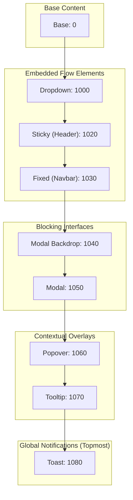
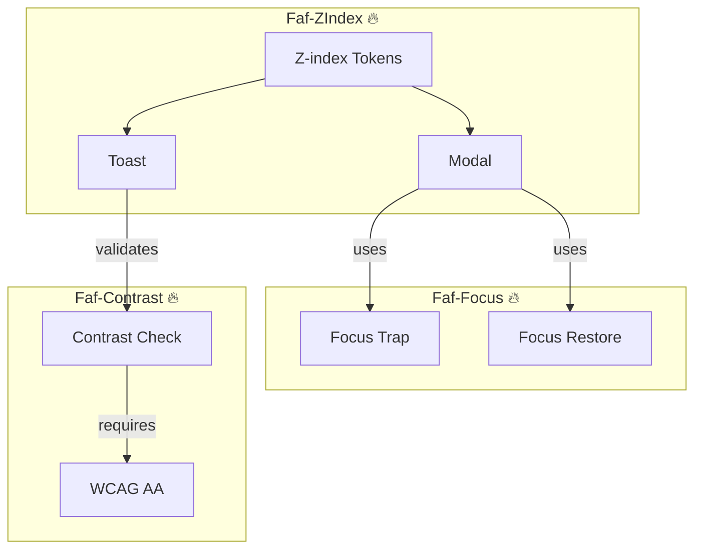

# @faf/z-index

> [EN](./README.md) | [RU](./README.ru.md)

**Layer Management System for the Faf Design System** — provides named z-index tokens instead of magic numbers, along with reference UI pattern implementations that guarantee correct stacking context behavior and accessibility (a11y) rules.

---

## 📁 Package Structure

```bash
packages/z-index/
├── src/
│   ├── tokens/
│   │   ├── index.ts                  # Token and type exports
│   │   └── zindex.ts                 # 🔥 SSOT: Named z-index values
│   ├── patterns/
│   │   ├── faf.modal.ts              # 🔥 Modal (1040/1050 + Focus Trap)
│   │   ├── faf.toast.ts              # 🔥 Toast (1080 + Active Contrast Check)
│   │   ├── faf.dropdown.ts           # 🔥 Dropdown (1000 + Keyboard Nav)
│   │   └── faf.tooltip.ts            # 🔥 Tooltip (1070 + Hover/Focus)
│   ├── utils/
│   │   ├── focus.ts                  # Helper for Focus Trap
│   │   └── contrast.ts               # Re-export of @faf/contrast utility
│   ├── styles/
│   │   └── tokens.generated.css      # ⚠️ Auto-generated CSS from zindex.ts
│   └── index.ts                      # Main package entry point
├── tests/                            # 🔥 Tests
│   ├── zindex-tokens.test.ts         # Unit tests for token contract (Vitest)
│   ├── contrast.test.ts              # Integration tests for @faf/contrast (Vitest)
│   └── patterns.spec.ts              # E2E tests for stacking context (Playwright)
├── viewer/                           # 🔥 Interactive documentation
│   ├── index.html                    # Viewer entry point
│   ├── styles.css                    # Viewer styles (with theme support)
│   └── viewer.js                     # Category switching and demo logic
├── docs/                             # 🔥 Additional documentation
├── dist/                             # Build output
├── package.json
├── tsconfig.json                     # TypeScript configuration
├── vite.config.ts                    # Vite configuration
├── vitest.config.ts                  # Unit tests configuration
└── playwright.config.ts              # E2E tests configuration
```

---

## 🏗️ Architectural Diagrams

### 1. Layer Hierarchy



### 2. Ecosystem Integration



---

## 📖 Pattern Implementation Guide

**Why are patterns in the z-index package?**
Patterns (`FafModal`, `FafToast`, `FafDropdown`, `FafTooltip`) are here not as a replacement for a UI library, but as **reference implementations**. They prove that the token system works in the real DOM and demonstrate the correct way to apply the Layer Contract.

**Styling Contract:**

1. **Encapsulation:** Structure, local states, and a11y are managed inside Shadow DOM.
2. **Theming:** The primary mechanism is `--faf-*` CSS custom properties, acting as the public API.
3. **Context:** `:host-context([data-theme="dark"])` is allowed ONLY for context-aware variable overrides, never for duplicating state logic.
4. **No `::slotted` for interactivity:** Complex hover/focus scenarios for projected content are handled by the child component's own Shadow DOM (e.g., `FafDropdownItem`).

---

## 📚 Stacking Context Guide

**What is it?**
A stacking context is an independent 3D rendering order on the Z-axis. Elements inside one context are ordered relative to each other but cannot "break out" to overlay elements from another context using only `z-index`.

**What creates a new context?**

- `position: absolute | relative | fixed | sticky` with `z-index` other than `auto`.
- `opacity < 1`, `transform`, `filter`, `backdrop-filter`, `clip-path`, `mask`.
- `isolation: isolate`, `mix-blend-mode` other than `normal`.
- Flex/Grid children with `z-index` other than `auto`.
- `popover` and `<dialog>` elements.

**Faf Design System Rules:**

1. Use `z-index` only with intentional positioning and `--faf-z-*` tokens.
2. If an element disappears, check parent stacking contexts first, not just `z-index`.
3. Never use magic numbers like `9999`.
4. Avoid accidental stacking contexts via hacks like `opacity: 0.99`.

**Practical Rule:**
If something doesn't overlay as expected, find the **stacking context boundary** first, then adjust `z-index`.

---

## 🚀 Quick Start

### Using Tokens in CSS

```css
@import "@faf/z-index/styles";

.my-custom-modal {
  position: fixed;
  z-index: var(--faf-z-modal);
  background: var(--faf-color-surface);
}
```

### Using Patterns in TypeScript

```typescript
import { zIndexTokens, FafModal } from "@faf/z-index";

console.log(zIndexTokens.toast); // 1080

const modal = document.createElement("faf-modal");
modal.innerHTML = `<span slot="title">Confirmation</span><p>Are you sure?</p>`;
document.body.appendChild(modal);
modal.open(); // Automatically activates Focus Trap
```

---

## 📐 Layer Contract

| Token                    | Value  | Purpose              | Example           |
| :----------------------- | :----- | :------------------- | :---------------- |
| `--faf-z-base`           | `0`    | Base layer           | Main page content |
| `--faf-z-dropdown`       | `1000` | Embedded overlays    | Menus, selects    |
| `--faf-z-sticky`         | `1020` | Sticky elements      | Table headers     |
| `--faf-z-fixed`          | `1030` | Fixed elements       | Global navbar     |
| `--faf-z-modal-backdrop` | `1040` | Modal dimming        | Modal backdrop    |
| `--faf-z-modal`          | `1050` | Modal windows        | Dialogs           |
| `--faf-z-popover`        | `1060` | Popovers             | Floating panels   |
| `--faf-z-tooltip`        | `1070` | Tooltips             | Hover/focus hints |
| `--faf-z-toast`          | `1080` | Global notifications | Toasts, alerts    |

---

## 🧩 Pattern Features

1. **FafModal (1040/1050):** Implements Focus Trap, closes on `Escape` / backdrop click, restores focus.
2. **FafToast (1080):** Appears above all elements. Actively validates text contrast via `@faf/contrast`. _(Note: The "success" toast intentionally triggers a console warning about insufficient contrast to demonstrate real-time a11y checking)._
3. **FafDropdown (1000):** Supports arrow key navigation, closes on outside click / `Escape`.
4. **FafTooltip (1070):** Works on `:hover` and `:focus`, uses `aria-describedby`, prevents sticking after mouse click.

---

## ⚙️ Generation & Testing

```bash
cd packages/z-index
pnpm run generate:tokens
pnpm run test
pnpm run test:e2e
pnpm run dev:viewer
```

---

## ❓ FAQ

**1. Why no `z-index: 9999`?**
Magic numbers break system predictability. A modal with `9999` would overlay a toast (`1080`), hiding system notifications.

**2. Why are patterns here and not in `@faf/components`?**
They are the **specification of the layer system**, validating that tokens work correctly in the real DOM regarding stacking context and accessibility.

**3. How do patterns handle Light/Dark themes?**
Patterns **do not define** their own colors. They read semantic tokens (`--faf-color-surface`, `--faf-color-text`) directly from `@faf/foundations`.

---

## 📝 License

MIT © Faf Design System
