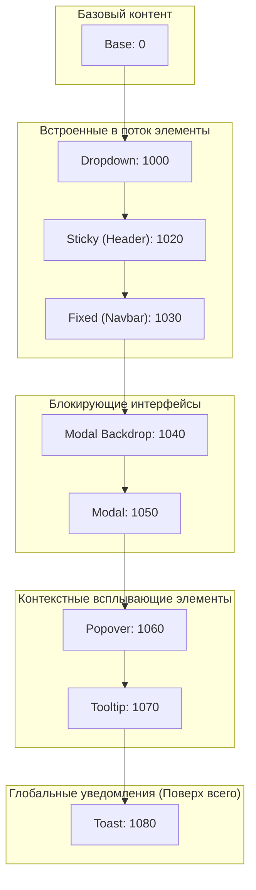
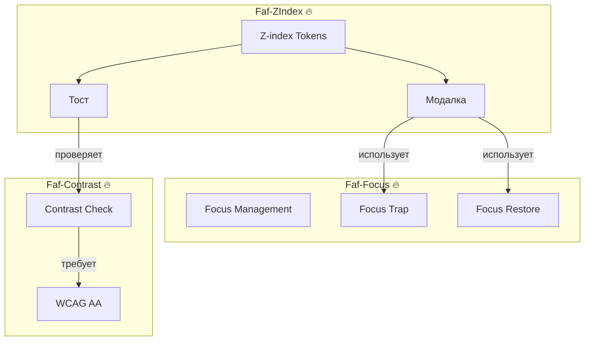
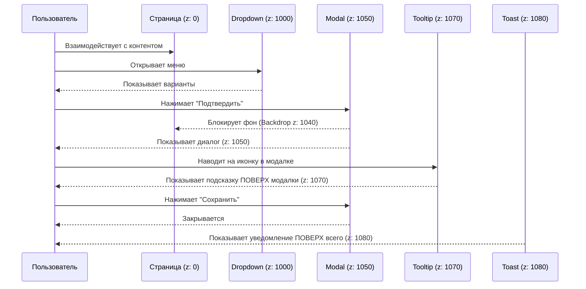
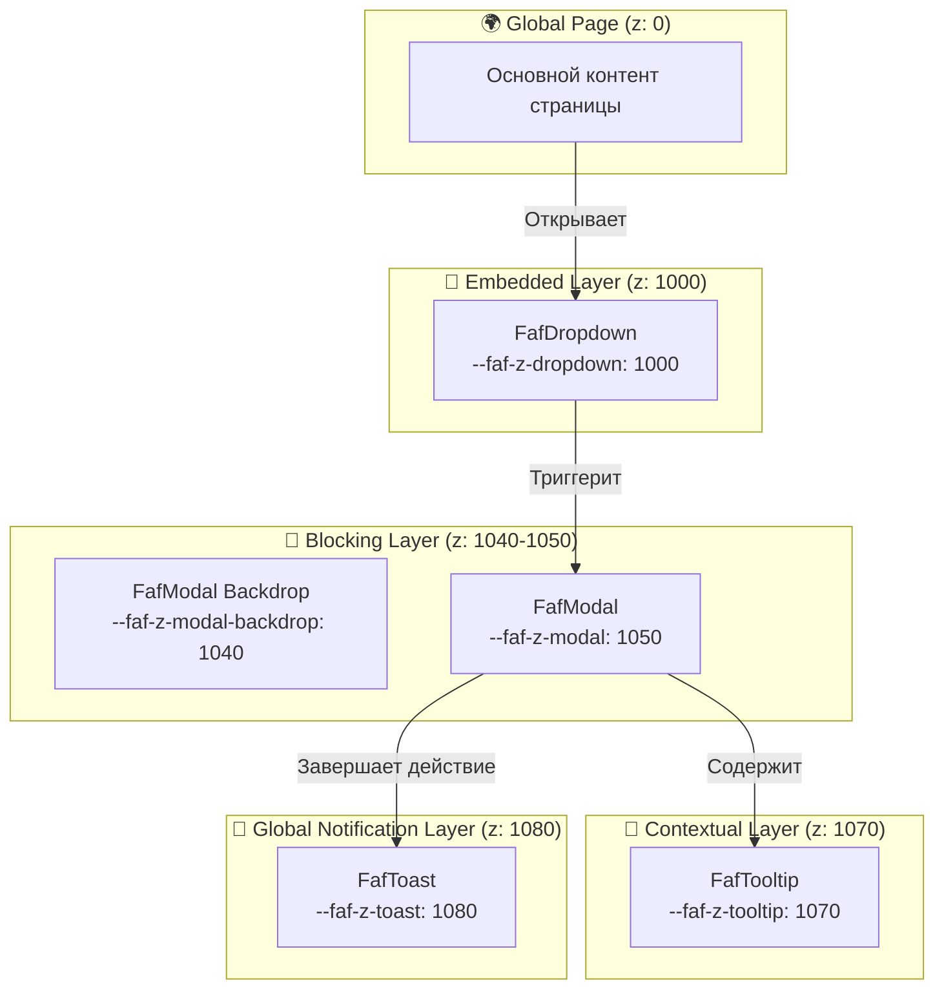

# @faf/z-index

> [EN](./README.md) | [RU](./README.ru.md)

**Система управления слоями дизайн-системы Faf** — предоставляет именованные z-index токены вместо магических чисел, а также эталонные реализации UI-паттернов, гарантирующие правильное соблюдение stacking context и правил доступности (a11y).

---

## 📁 Структура пакета

```bash
packages/z-index/
├── src/
│   ├── tokens/
│   │   ├── index.ts                  # Экспорт токенов и типов
│   │   └── zindex.ts                 # 🔥 SSOT: Именованные значения z-index
│   ├── patterns/
│   │   ├── faf.modal.ts              # 🔥 Модалка (1040/1050 + Focus Trap)
│   │   ├── faf.toast.ts              # 🔥 Тост (1080 + Активная проверка контраста)
│   │   ├── faf.dropdown.ts           # 🔥 Дропдаун (1000 + Keyboard Nav)
│   │   └── faf.tooltip.ts            # 🔥 Тултип (1070 + Hover/Focus)
│   ├── utils/
│   │   ├── focus.ts                  # Хелпер для Focus Trap
│   │   └── contrast.ts               # Реэкспорт утилиты @faf/contrast
│   ├── styles/
│   │   └── tokens.generated.css      # ⚠️ Автогенерируемый CSS из zindex.ts
│   └── index.ts                      # Главная точка входа пакета
├── tests/                            # 🔥 Тесты
│   ├── zindex-tokens.test.ts         # Unit-тесты контракта токенов (Vitest)
│   ├── contrast.test.ts              # Интеграционные тесты @faf/contrast (Vitest)
│   └── patterns.spec.ts              # E2E-тесты stacking context (Playwright)
├── viewer/                           # 🔥 Интерактивная документация
│   ├── index.html                    # Точка входа viewer
│   ├── styles.css                    # Стили viewer (с поддержкой тем)
│   └── viewer.js                     # Логика переключения категорий и демо
├── docs/                             # 🔥 Дополнительная документация
├── dist/                             # Сборка (генерируется командой build)
├── package.json
├── tsconfig.json                     # TypeScript-конфигурация
├── vite.config.ts                    # Vite-конфигурация
├── vitest.config.ts                  # Конфиг для Unit-тестов
└── playwright.config.ts              # Конфиг для E2E-тестов
```

---

## 🏗️ Архитектурные диаграммы

### 1. Иерархия слоёв (Layer Hierarchy)



### 2. Интеграция паттернов с экосистемой Faf



### 3. Система слоёв: Сценарий взаимодействия (Sequence)



### 4. Система слоёв: Визуальный стек (Flowchart)



---

## 📦 Установка

```bash
# Из корня монорепозитория (для локальной разработки)
pnpm install

# Или при использовании как внешней зависимости
pnpm add @faf/z-index
```

---

## 🚀 Быстрый старт

### Использование токенов в CSS

```css
@import "@faf/z-index/styles";

.my-custom-modal {
  position: fixed;
  /* 🔥 Используем токен вместо магического числа */
  z-index: var(--faf-z-modal);
  background: var(--faf-color-surface); /* Из @faf/foundations */
}
```

### Использование паттернов в TypeScript / HTML

```typescript
import { zIndexTokens, FafModal } from "@faf/z-index";

// 1. Проверка значения токена
console.log(zIndexTokens.toast); // 1080

// 2. Использование Web Component паттерна
const modal = document.createElement("faf-modal");
modal.innerHTML = `
  <span slot="title">Подтверждение</span>
  <p>Вы уверены?</p>
`;
document.body.appendChild(modal);

// Открытие модалки (автоматически активирует Focus Trap)
modal.open();
```

---

## 🏗️ Архитектура: Токены и Паттерны (FAF Styling Contract)

### Z-index Tokens (Контракт слоёв)

Это **единственный источник истины (SSOT)** для значений `z-index` в системе. Они предотвращают использование магических чисел (вроде `9999`) и гарантируют математически корректную иерархию наложения.

### Эталонные паттерны (Reference Patterns)

Паттерны находятся в этом пакете, чтобы выполнять три инженерные задачи:

1. **Валидация:** Доказывают, что токены работают корректно в реальном DOM (stacking context).
2. **Живая документация:** Показывают разработчикам, _как именно_ нужно применять токены вместе с правилами доступности.
3. **Готовые компоненты:** Могут быть использованы "как есть" для быстрого старта.

**Строгое соблюдение FAF Web Components Styling Contract:**

- **Инкапсуляция:** Каждый компонент управляет структурой и локальными состояниями (`:hover`, `:focus`) внутри Shadow DOM.
- **Темизация:** Строится на CSS custom properties `--faf-*`, которые наследуются через границу shadow root.
- **Контекст:** `:host-context()` разрешён **только** для контекстных переопределений токенов, а не для дублирования state-логики.
- **Слоты:** `::slotted()` используется только для простого оформления projected content, без сложных hover/focus сценариев.
- **Локальные переменные:** Допустимы локальные переменные вида `--item-hover-bg`, если они маппятся на глобальные токены.

---

## 📐 Система слоёв (Layer Contract)

| Токен                    | Значение | Назначение                      | Пример использования          |
| :----------------------- | :------- | :------------------------------ | :---------------------------- |
| `--faf-z-base`           | `0`      | Базовый слой                    | Основной контент страницы     |
| `--faf-z-dropdown`       | `1000`   | Встроенные всплывающие элементы | Меню, селекторы, autocomplete |
| `--faf-z-sticky`         | `1020`   | Закреплённые элементы           | Заголовки таблиц, сайдбары    |
| `--faf-z-fixed`          | `1030`   | Фиксированные элементы          | Глобальный навбар             |
| `--faf-z-modal-backdrop` | `1040`   | Затемнение модального окна      | Backdrop модалки              |
| `--faf-z-modal`          | `1050`   | Модальные окна                  | Диалоги, формы подтверждения  |
| `--faf-z-popover`        | `1060`   | Поповеры                        | Всплывающие панели действий   |
| `--faf-z-tooltip`        | `1070`   | Всплывающие подсказки           | Тултипы при наведении/фокусе  |
| `--faf-z-toast`          | `1080`   | Глобальные уведомления          | Тосты, системные алерты       |

---

## 🧩 Особенности паттернов

1. **FafModal (1040/1050):** Реализует Focus Trap, закрывается по `Escape` и клику на backdrop, возвращает фокус на триггер.
2. **FafToast (1080):** Появляется поверх всех элементов. Активно проверяет контрастность текста через утилиту `@faf/contrast`. _(Примечание: тост типа "success" намеренно вызывает предупреждение в консоли о недостаточной контрастности, чтобы продемонстрировать работу системы проверки доступности в реальном времени)._
3. **FafDropdown (1000):** Поддерживает навигацию стрелками, закрывается по клику вне области и по `Escape`. Дочерний `FafDropdownItem` имеет собственный Shadow DOM для корректной стилизации `:hover`.
4. **FafTooltip (1070):** Работает при `:hover` и `:focus` (требование WCAG), использует `aria-describedby`, предотвращает залипание при клике мышью.

---

## ⚙️ Генерация и Тестирование

```bash
# Генерация токенов
cd packages/z-index
pnpm run generate:tokens

# Unit-тесты (Vitest)
pnpm run test

# E2E-тесты (Playwright, автоматически поднимает viewer)
pnpm run test:e2e

# E2E-тесты в интерактивном UI-режиме
pnpm run test:e2e:ui

# Запуск интерактивного Viewer
pnpm run dev:viewer
```

---

## ❓ FAQ

**1. Почему нельзя использовать `z-index: 9999`?**  
Использование магических чисел ломает предсказуемость системы. Если модалка получит `9999`, она перекроет тост (`1080`), и пользователь не увидит системное уведомление.

**2. Почему паттерны находятся здесь, а не в `@faf/components`?**  
Потому что они являются **спецификацией системы слоёв**. Их главная цель — валидация токенов в реальном DOM с учётом stacking context и доступности.

**3. Как паттерны работают с темами (Light/Dark)?**  
Паттерны **не определяют** свои собственные цвета. Они читают семантические токены (`--faf-color-surface`, `--faf-color-text`) напрямую из `@faf/foundations`. Переключение `<html data-theme="dark">` автоматически обновляет их через наследование CSS-переменных.

**4. Почему тост "success" показывает предупреждение о контрасте в консоли?**  
Это намеренная фича, а не баг. Она демонстрирует, что интеграция с `@faf/contrast` активно работает. Белый текст на стандартном зелёном фоне (`#16a34a`) не проходит WCAG AA (коэффициент ~3.1:1). В реальном проекте вы бы либо затемнили зелёный, либо использовали чёрный текст, как рекомендует предупреждение.

---

## 📝 Лицензия

MIT © Faf Design System
