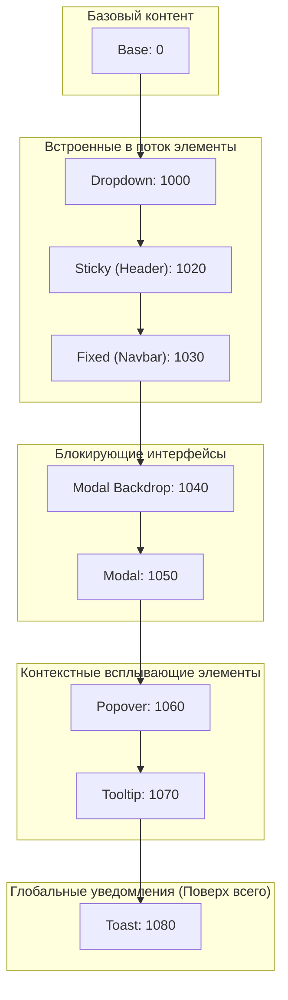
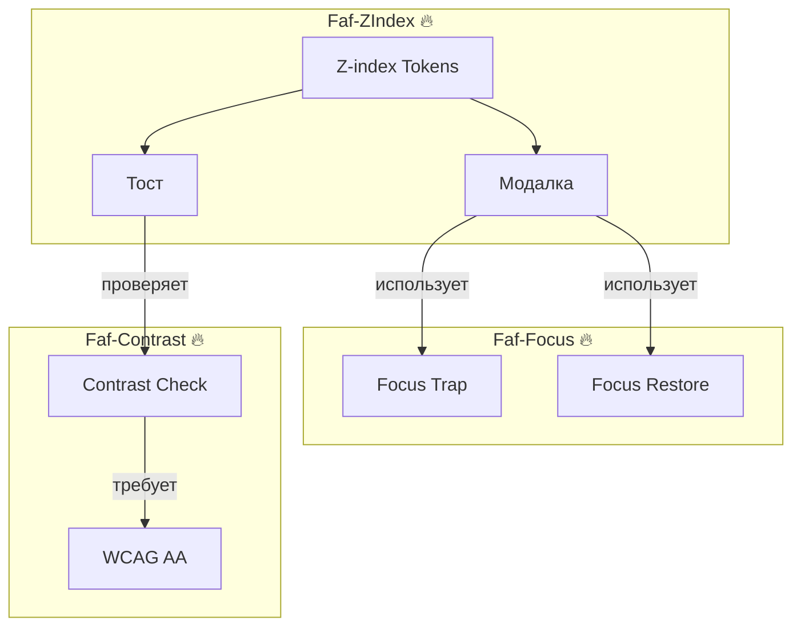

# @faf/z-index

> [EN](./README.md) | [RU](./README.ru.md)

**Система управления слоями дизайн-системы Faf** — предоставляет именованные z-index токены вместо магических чисел, а также эталонные реализации UI-паттернов, гарантирующие правильное соблюдение stacking context и правил доступности (a11y).

---

## 📁 Структура пакета

```bash
packages/z-index/
├── src/
│   ├── tokens/
│   │   ├── index.ts                  # Экспорт токенов и типов
│   │   └── zindex.ts                 # 🔥 SSOT: Именованные значения z-index
│   ├── patterns/
│   │   ├── faf.modal.ts              # 🔥 Модалка (1040/1050 + Focus Trap)
│   │   ├── faf.toast.ts              # 🔥 Тост (1080 + Активная проверка контраста)
│   │   ├── faf.dropdown.ts           # 🔥 Дропдаун (1000 + Keyboard Nav)
│   │   └── faf.tooltip.ts            # 🔥 Тултип (1070 + Hover/Focus)
│   ├── utils/
│   │   ├── focus.ts                  # Хелпер для Focus Trap
│   │   └── contrast.ts               # Реэкспорт утилиты @faf/contrast
│   ├── styles/
│   │   └── tokens.generated.css      # ⚠️ Автогенерируемый CSS из zindex.ts
│   └── index.ts                      # Главная точка входа пакета
├── tests/                            # 🔥 Тесты
│   ├── zindex-tokens.test.ts         # Unit-тесты контракта токенов (Vitest)
│   ├── contrast.test.ts              # Интеграционные тесты @faf/contrast (Vitest)
│   └── patterns.spec.ts              # E2E-тесты stacking context (Playwright)
├── viewer/                           # 🔥 Интерактивная документация
│   ├── index.html                    # Точка входа viewer
│   ├── styles.css                    # Стили viewer (с поддержкой тем)
│   └── viewer.js                     # Логика переключения категорий и демо
├── docs/                             # 🔥 Дополнительная документация
├── dist/                             # Сборка (генерируется командой build)
├── package.json
├── tsconfig.json                     # TypeScript-конфигурация
├── vite.config.ts                    # Vite-конфигурация
├── vitest.config.ts                  # Конфиг для Unit-тестов
└── playwright.config.ts              # Конфиг для E2E-тестов
```

---

## 🏗️ Архитектурные диаграммы

### 1. Иерархия слоёв



### 2. Интеграция с экосистемой



---

## 📖 Руководство по реализации паттернов

**Зачем паттерны в пакете z-index?**  
Паттерны (`FafModal`, `FafToast`, `FafDropdown`, `FafTooltip`) находятся здесь не как замена UI-библиотеке, а как **эталонные реализации**. Они доказывают, что система токенов работает в реальном DOM, и демонстрируют правильный способ применения Layer Contract.

**Контракт стилизации:**

1. **Инкапсуляция:** Структура, локальные состояния и доступность управляются внутри Shadow DOM.
2. **Темизация:** Основной механизм — CSS custom properties `--faf-*`, выступающие как публичный API.
3. **Контекст:** `:host-context([data-theme="dark"])` допускается ТОЛЬКО для точечного переопределения переменных, а не для дублирования логики состояний.
4. **Нет `::slotted` для интерактива:** Сложные сценарии hover/focus для проецируемого контента реализуются через собственный Shadow DOM дочерних компонентов (например, `FafDropdownItem`).

---

## 📚 Руководство по контексту наложения (Stacking Context)

**Что это такое?**  
Stacking context — это независимый контекст наложения элементов по оси Z. Элементы внутри одного контекста упорядочиваются относительно друг друга, но не могут «выпрыгнуть» и перекрыть элементы из другого контекста только за счёт `z-index`.

**Что создаёт новый контекст?**

- `position: absolute | relative | fixed | sticky` с `z-index`, отличным от `auto`.
- `opacity < 1`, `transform`, `filter`, `backdrop-filter`, `clip-path`, `mask`.
- `isolation: isolate`, `mix-blend-mode`, отличный от `normal`.
- Дочерние элементы Flex/Grid с `z-index`, отличным от `auto`.
- Элементы `popover` и `<dialog>`.

**Правила Faf Design System:**

1. Используйте `z-index` только в связке с осознанным позиционированием и токенами `--faf-z-*`.
2. Если элемент «пропадает», сначала проверьте родительские stacking context, а не только `z-index`.
3. Никогда не используйте магические числа вроде `9999`.
4. Избегайте случайного создания контекста через хаки вроде `opacity: 0.99`.

**Практическое правило:**  
Если что-то не перекрывается как ожидается, сначала ищите **границу stacking context**, и только потом настраивайте `z-index`.

---

## 🚀 Быстрый старт

### Использование токенов в CSS

```css
@import "@faf/z-index/styles";

.my-custom-modal {
  position: fixed;
  z-index: var(--faf-z-modal);
  background: var(--faf-color-surface);
}
```

### Использование паттернов в TypeScript

```typescript
import { zIndexTokens, FafModal } from "@faf/z-index";

console.log(zIndexTokens.toast); // 1080

const modal = document.createElement("faf-modal");
modal.innerHTML = `<span slot="title">Подтверждение</span><p>Вы уверены?</p>`;
document.body.appendChild(modal);
modal.open(); // Автоматически активирует Focus Trap
```

---

## 📐 Система слоёв (Layer Contract)

| Токен                    | Значение | Назначение                      | Пример использования         |
| :----------------------- | :------- | :------------------------------ | :--------------------------- |
| `--faf-z-base`           | `0`      | Базовый слой                    | Основной контент страницы    |
| `--faf-z-dropdown`       | `1000`   | Встроенные всплывающие элементы | Меню, селекторы              |
| `--faf-z-sticky`         | `1020`   | Закреплённые элементы           | Заголовки таблиц             |
| `--faf-z-fixed`          | `1030`   | Фиксированные элементы          | Глобальный навбар            |
| `--faf-z-modal-backdrop` | `1040`   | Затемнение модального окна      | Backdrop модалки             |
| `--faf-z-modal`          | `1050`   | Модальные окна                  | Диалоги                      |
| `--faf-z-popover`        | `1060`   | Поповеры                        | Всплывающие панели           |
| `--faf-z-tooltip`        | `1070`   | Всплывающие подсказки           | Тултипы при наведении/фокусе |
| `--faf-z-toast`          | `1080`   | Глобальные уведомления          | Тосты, системные алерты      |

---

## 🧩 Особенности паттернов

1. **FafModal (1040/1050):** Реализует Focus Trap, закрывается по `Escape` и клику на backdrop, возвращает фокус.
2. **FafToast (1080):** Появляется поверх всех элементов. Активно проверяет контрастность текста через `@faf/contrast`. _(Примечание: тост типа "success" намеренно вызывает предупреждение в консоли о недостаточной контрастности, чтобы продемонстрировать работу системы проверки доступности в реальном времени)._
3. **FafDropdown (1000):** Поддерживает навигацию стрелками, закрывается по клику вне области и по `Escape`.
4. **FafTooltip (1070):** Работает при `:hover` и `:focus`, использует `aria-describedby`, предотвращает залипание при клике мышью.

---

## ⚙️ Генерация и Тестирование

```bash
cd packages/z-index
pnpm run generate:tokens
pnpm run test
pnpm run test:e2e
pnpm run dev:viewer
```

---

## ❓ FAQ

**1. Почему нельзя использовать `z-index: 9999`?**  
Использование магических чисел ломает предсказуемость системы. Если модалка получит `9999`, она перекроет тост (`1080`), и пользователь не увидит системное уведомление.

**2. Почему паттерны находятся здесь, а не в `@faf/components`?**  
Потому что они являются **спецификацией системы слоёв**, валидирующей, что токены работают корректно в реальном DOM с учётом stacking context и доступности.

**3. Как паттерны работают с темами (Light/Dark)?**  
Паттерны **не определяют** свои собственные цвета. Они читают семантические токены (`--faf-color-surface`, `--faf-color-text`) напрямую из `@faf/foundations`.

---

## 📝 Лицензия
